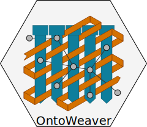

# OntoWeaver

## Overview

OntoWeaver is a Python module for importing tables data in
Semantic Knowledge Graphs (SKG) databases.

OntoWeaver allows to write a simple declarative mapping to express how columns from
a [Pandas](https://pandas.pydata.org/) table are to be converted as typed nodes
or edges in a SKG.



It provides a simple layer of abstraction on top of [Biocypher](https://biocypher.org),
which remains responsible for doing the ontology alignment,
supporting several graph database backend,
and allowing reproducible & configurable builds.

With a pure Biocypher approach, you would have to write a whole adapter by hand,
with OntoWeaver, you just have to express a mapping in YAML, looking like:
```yaml
row:
   map:
      columns: # Optional, you can also only write to_subject: 
        - <column_name> # which then uses indexes instead of cell values.
      to_subject: <line_node_type>
transformers:
    - map:
        columns:
            - <column_name>
        to_object: <col_node_type>
        via_relation: <edge_type>

```

## Installation and quick setup guide

### Python Module

The project uses [Poetry](https://python-poetry.org). You can install like this:

```
git clone https://github.com/oncodash/ontoweaver.git
cd ontoweaver
poetry install
```

Poetry will create a virtual environment according to your configuration (either
centrally or in the project folder). You can activate it by running `poetry
shell` inside the project directory.

### Database

Theoretically, any graph database supported by Biocypher may be used.

### Graph visualization

Neo4j is a popular graph database management system that offers a flexible and efficient way
to store, query, and manipulate complex, interconnected data. Cypher is the query language
used to interact with Neo4j databases. In order to visualize graphs extracted from databases using OntoWeaver and
BioCypher, you can download the [Neo4j Graph Database Self-Managed]
(https://neo4j.com/deployment-center/) for your operating system. It has been extensively tested
with the Community edition.

To create a global variable to Neo4j, add the path to `neo4j-admin` to PATH and `PYTHONPATH`. In order to use the Neo4j browser, you will
need to install the correct Java version, depending on the Neo4j version you are using, and add the path to `JAVA_HOME`. 
OntoWeaver and BioCypher  support versions 4 and 5 of Neo4j.

To run Neo4j (version 5+), use the command `neo4j-admin server start` after importing your results via the neo4j import sequence
provided in the `./biocypher-out/` directory. Use `neo4j-admin server stop` to disconnect the local server.


### Tests

Tests are located in the `tests/` subdirectory and may be a good starting point
to see OntoWeaver in practice. You may start with `tests/test_simplest.py` which
shows the simplest example of mapping tabular data through BioCypher.

To run tests, use `pytest`:
```
poetry run pytest
```
or, alternatively:
```
poetry shell
pytest
```


## Usage

OntoWeaver actually automatically provides a working adapter for BioCypher,
without you having to do it.

The output of the execution of the adapter is thus what BioCypher is providing
(see [BioCypher's documentation](https://biocypher.org)).
In a nutshell, the output is a script file that, when executed, will populate
the configured database.
By default, the output script file is saved in a subdirectory of `./biocypher-out/`,
which name is a timestamp from when the adapter have been executed.

To actually insert data in a SKG database, you will have to use Biocypher
export API:
```python
    import yaml
    import pandas as pd
    import biocypher
    import ontoweaver

    # Load ontology
    bc = biocypher.BioCypher(
        biocypher_config_path = "tests/simplest/biocypher_config.yaml",
        schema_config_path = "tests/simplest/schema_config.yaml"
    )

    # Load data
    table = pd.read_csv("tests/simplest/data.csv")

    # Load mapping
    with open("tests/simplest/mapping.yaml") as fd:
        mapping = yaml.full_load(fd)

    # Run the adapter
    adapter = ontoweaver.tabular.extract_all(table, mapping)

    # Write nodes
    bc.write_nodes( adapter.nodes )

    # Write edges
    bc.write_edges( adapter.edges )

    # Write import script
    bc.write_import_call()

    # Now you have a script that you can run to actually insert data.
```
Additionally, you will have to define a strategy for the naming of mapped items when creating nodes, by defining an `affix` and `separator`
to be used during node creation. The `affix` used will represent the ontology type of the item in question. Unless otherwise defined, 
the `affix` defaults to `suffix` and `separator` defaults to `:`. This can be modified by changing the variables in the
`extract_all()` function. `Affix` can be either a `prefix`, `suffix` or `none` - in case you decide not to include the ontology type in 
the node naming strategy. Special care should be exercised in case there are several types of the same name in the database. There is a 
possibility that nodes of the same name will be merged together during mapping, so an `affix` should be present. Below are some examples of
node naming strategies. `NAME` refers to the name of the item in question in your database, and `TYPE` refers to the type of the item 
in the ontology.
```python
...

   # Affix defaults to "suffix", and separator defaults to ":"
   # Node represented as [NAME]:[TYPE]
   adapter = ontoweaver.tabular.extract_all(table, mapping)
   
   # Node represented as [TYPE]-[NAME]
   adapter = ontoweaver.tabular.extract_all(table, mapping, affix = "prefix", separator = "-")
   
   # Node represented as [NAME] 
   adapter = ontoweaver.tabular.extract_all(table, mapping, affix = "none")

...
```


## Mapping API

OntoWeaver essentially creates a Biocypher adapter from the description of a
mapping from a table to ontology types.
As such, its core input is a dictionary, that takes the form of a YAML file.
This configuration file indicates:

- to which (node) type to map each line of the table,
- to which (node) type to map columns of the table,
- with which (edge) types to map relationships between nodes.

The following explanations assume that you are familiar with
[Biocypher's configuration](https://biocypher.org/tutorial-ontology.html),
notably how it handles ontology alignment with
schema configuration.


### Common Mapping

The minimal configuration would be to map lines and one column, linked with
a single edge type.

For example, if you have the following CSV table of phenotypes/patients:
```
phenotype,patient
0,A
1,B
```
and if you target the Biolink ontology, using a schema configuration(i.e. subset of types), 
defined in your `shcema_config.yaml` file, as below:
```yaml
phenotypic feature:
    represented_as: node
    label_in_input: phenotype
case:
    represented_as: node
    label_in_input: case
case to phenotypic feature association:
    represented_as: edge
    label_in_input: case_to_phenotype
    source: phenotypic feature
    target: case
```
you may write the following mapping:
```yaml
row:
   map:
      to_subject: phenotype
transformers:
    - map:
        columns: 
            - patient # Name of the column in the table.
        to_object: case # Node type to export to (most probably the same as in the ontology).
        via_relation: case_to_phenotype # Edge type to export to.

```

This configuration will end in creating a node for each phenotype, a node
for each patient, and an edge for each phenotype-patient pair:
```
          case to phenotypic
          feature association
                    ↓
           ╭───────────────────╮
           │              ╔════╪════╗
           │              ║pati│ent ║
           │              ╠════╪════╣
╭──────────┴──────────╮   ║╭───┴───╮║
│phenotypic feature: 0│   ║│case: A│║
╰─────────────────────╯   ║╰───────╯║
                          ╠═════════╣
╭─────────────────────╮   ║╭───────╮║
│          1          │   ║│   B   │║
╰──────────┬──────────╯   ║╰───┬───╯║
           │              ╚════╪════╝
           ╰───────────────────╯
```


### How to Add an Edge Between Column Nodes

If you need to add an edge between a column node to another (and not between
the line node and a column node), you can use the `from_subject` predicate,
for example:
```yaml
row:
   map:
      to_subject: phenotype
transformers:
    - map:
        columns:
            - patient
        to_object: case
        via_relation: case_to_phenotype
    - map:
        columns:
            - disease
        from_subject: case # The edge will start from this node type...
        to_object: disease # ... to this node type.
        via_relation: disease_to_entity_association_mixin

```

```
           ╭───────────────────╮
           │              ╔════╪════╦════════════════════╗
           │              ║pati│ent ║      disease       ║
           │              ╠════╪════╬════════════════════╣
           │              ║    │    ║disease to          ║
           │              ║    │    ║entity              ║
╭──────────┴──────────╮   ║╭───┴───╮║  ↓    ╭───────────╮║
│phenotypic feature: 0│   ║│case: A├╫───────┤ disease: X│║
╰─────────────────────╯   ║╰───────╯║       ╰┬──────────╯║
                          ╠═════════╬════════╪═══════════╣
╭─────────────────────╮   ║╭───────╮║       ╭┼╌╌╌╌╌╌╌╌╌╌╮║
│          1          │   ║│   B   ├╫────────╯    X     ┆║
╰──────────┬──────────╯   ║╰───┬───╯║       ╰╌╌╌╌╌╌╌╌╌╌╌╯║
           │              ╚════╪════╩════════════════════╝
           ╰───────────────────╯
```

### How to Add Properties to Nodes and Edges

If you do not need to create a new node, but simply attach some data to an existing
node, use the `to_property` predicate, for example:
```yaml
row:
   map:
      to_subject: phenotype
transformers:
    - map:
        columns:
            - patient
        to_object: case
        via_relation: case_to_phenotype
    - map:
        columns:
            - age
        to_property: 
            - patient_age
        for_objects:
            - case

```
This will add a "patient_age" property to nodes of type "case".

Note that you can add the same property to several types.


### How to Use Transformers

If you want to transform a data cell before exporting it as one or several
nodes, you will use *transformers*.


#### `map`

The *mqp* transformer simply extracts the value of the cell defined, and is the most common way of mapping cell values.

For ecxample:

```yaml
    - map:
        columns:
            - patient
        to_object: case
```


#### `split`

The *split* transformer separates a string on a separator, into several items,
and then inserts a node for each element of the list.

For example, if you have a list of treatments separated by a semicolon,
you may write:
```yaml
row:
   map:
      to_subject: phenotype
transformers:
    - map:
        columns:
            - variant
        to_object: variant
        via_relation: phenotype_to_variant
    - split:
        columns:
            - treatments
        from_subject: variant
        to_object: drug
        via_relation: variant_to_drug
        separator: ";"

```

```
     phenotype to variant      variant to drug
             ↓                       ↓
       ╭───────────────╮   ╭────────────────╮
       │         ╔═════╪═══╪═╦══════════════╪═════╗
       │         ║ vari│ant│ ║  treatments  │     ║
       │         ╠═════╪═══╪═╬══════════════╪═════╣
       │         ║     │   │ ║variant       │     ║
       │         ║     │   │ ║to drug       │     ║
╭──────┴─────╮   ║╭────┴───┴╮║  ↓    ╭──╮ ╭─┴────╮║
│phenotype: 0│   ║│variant:A├╫───────┤ X│;│drug:Y│║
╰────────────╯   ║╰─────────╯║       ╰┬─╯ ╰──────╯║
                 ╠═══════════╬════════╪═══════════╣
╭────────────╮   ║╭─────────╮║       ╭│ ╮ ╭──╮    ║
│      1     │   ║│    B    ├╫────────╯X ;│ Z│    ║
╰──────┬─────╯   ║╰────┬───┬╯║       ╰  ╯ ╰─┬╯    ║
       │         ╚═════╪═══╪═╩══════════════╪═════╝
       ╰───────────────╯   ╰────────────────╯
```

#### `cat`

The *cat* transformer concatenates the values cells of the defined columns and then inserts a single node.
For example, the mapping below would result in the concatenation of cell values from the columns `variant_id`,
and `disease`, to the node type `variant`. The values are concatenated in the order written in the `columns`
section.

```yaml
row:
   cat:
      columns: # List of columns whose cell values to be concatenated
        - variant_id
        - disease
      to_subject: variant # The ontology type to map to
```

#### `cat_format`

The user can also define the order and format of concatenation by creating a `format_string` field, which defines
the format of the concatenation. For example:

```yaml
row:
   cat:
      columns: # List of columns whose cell values to be concatenated
        - variant_id
        - disease
      to_subject: variant # The ontology type to map to
      format_string: "{disease}_____{variant_id}"
```

Although the examples above all define mapping of cell values to nodes, the transformers are also used to map 
cell values to properties of nodes and edges. For example:

```yaml
    - map:
        columns:
            - version
        to_property:
            - version
        for_objects:
            - patient # Node type.
            - variant
            - patient_has_variant # Edge type.
```


### Keywords Synonyms

Because several communities gathered around semantic knowledge graph,
several terms can be used (more or less) interchangeably.

OntoWeaver thus allows to use your favorite vocabulary to write down
the mapping configurations.

Here is the list of available synonyms:

- `subject` = `row` = `entry` = `line` = `source`
- `columns` = `fields`
- `to_object` = `to_target` = `to_node`
- `from_subject` = `from_source`
- `via_relation` = `via_edge` = `via_predicate`
- `to_property` = `to_properties`


### How to Create User-defined Classes

#### Dynamic Node and Edge Types

OntoWeaver relies a lot on meta-programming, as it actually creates
Python types while parsing the mapping configuration.
By default, those classes are dynamically created into the `ontoweaver.types`
module.

You may manually define your own types, derivating from `ontoweaver.base.Node`
or `ontoweaver.base.Edge`.

The `ontoweaver.types` module automatically gathers the list of available types
in the `ontoweaver.types.all` submodule.
This allows accessing the list of node and edge types:
```python
node_types  = types.all.nodes()
edge_types  = types.all.edges()
```

#### User-defined Adapters

You may manually define your own adapter class, inheriting
from the OntoWeaver's class that manages tabular mappings.

For example:
```python
class MYADAPTER(ontoweaver.tabular.PandasAdapter):

    def __init__(self,
        df: pd.DataFrame,
        config: dict,
        type_affix: Optional[ontoweaver.tabular.TypeAffixes] = ontoweaver.tabular.TypeAffixes.prefix,
        type_affix_sep: Optional[str] = "//",
    ):
        # Default mapping as a simple config.
        from . import types
        parser = ontoweaver.tabular.YamlParser(config, types)
        mapping = parser()

        super().__init__(
            df,
            *mapping,
        )
     

```
When manually defining adapter classes, be sure to define the affix type and separator you wish to use in the mapping. 
Unless otherwise defined, affix type defaults to `suffix` and separator defaults to `:`. In the example above, the affix type is defined as `prefix` and
the separator is defined as `//`. If you wish to define affix as `none`, you should use 
`type_affix: Optional[ontoweaver.tabular.TypeAffixes] = ontoweaver.tabular.TypeAffixes.none`, and if you wish to define affix type as `suffix`, use 
`type_affix: Optional[ontoweaver.tabular.TypeAffixes] = ontoweaver.tabular.TypeAffixes.suffix`.


#### How to Extract Additional Edges

Edges can be extracted from the mapping configuration, by defining a `from_subject` and `to_object` in the mapping configuration,
where the `from_subject` is the node type from which the edge will start, and the `to_object` is the node type to which the edge will end.

For example, consider the following mapping configuration for the sample dataset below:

```
id	patient	        sample
0	patient1	sample1
1	patient2	sample2
2	patient3	sample3
3	patient4	sample4
```

```yaml
row:
    map:
        columns:
            - id
        to_subject: variant
transformers:
    - map:
          columns:
              - patient
          to_object: patient
          via_relation: patient_has_variant
    - map:
          columns:
              - sample
          to_object: sample
          via_relation: variant_in_sample
```
If the user would like to extract an additional edge from the node type `patient` to the node type `sample`, they would
need to add the following section to the transformers in the mapping configuration:

```yaml
    - map:
        columns:
          - patient
        from_subject: sample
        to_object: patient
        via_relation: sample_to_patient
```