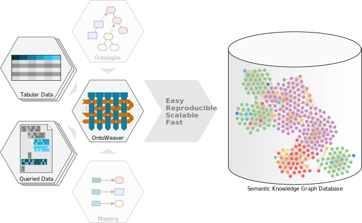
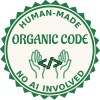

OntoWeaver is a tool that automatize the creation of knowledge graphs
from iterable data.

    OntoWeaver allows you to create Semantic Knowledge Graphs from
    either tabular data or data that can be queried in a document.

We provide three different introductions, with three different level of details
and vocabulary:

1) :ref:`intro-beginners`
2) :ref:`intro-skilled`
3) :ref:`intro-experts`

In a hurry? We suggest you jump to :ref:`fully_fledged_demo` and :ref:`how_to`.
But be warned that you'd better know the difference between a knowledge graph
and an ontology.

|

|

