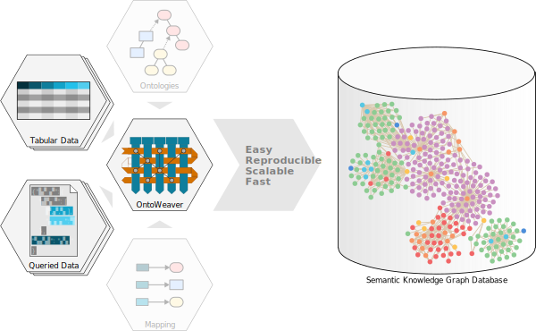

OntoWeaver is a tool that **automatize** the creation of **knowledge graphs**
from **existing data**.

It is made for people who want to **easily define their own graph structure**.
Why having to use a knowledge graph that does not fit the question you are asking
when you can easily make one that you perfectly understands? OntoWeaver allows
you to do that with just a **simple description** of the graph you want.

    OntoWeaver allows you to create Semantic Knowledge Graphs from
    either tabular data or data that can be queried in a document.

.. raw:: html

    

        

        OntoWeaver "killer features" that make it better than other solutions:
        

        

            &nbsp;
            

            Reads several data file formats, tables or documents.
            

        

        

            &nbsp;
            

            Lets you try various graph structures and contents.
            

        

        

            &nbsp;
            

            Exports to several knowkedge graph databases and formats.
            

        

        

            &nbsp;
            

            Allows reusing others' <i>database adapters</i> easily.
            

        

    

We provide three different introductions, with three different level of details
and vocabulary:

1) :ref:`intro-beginners`
2) :ref:`intro-skilled`
3) :ref:`intro-experts`

In a hurry? We suggest you jump to :ref:`fully_fledged_demo` and :ref:`how_to`.
If you're lost, get back at the introductions or the :ref:`basics_SKG`.

Questions? Issues? The project is maintained on Github at:
`oncodash/ontoweaver <https://github.com/oncodash/ontoweaver>`_

|

|

