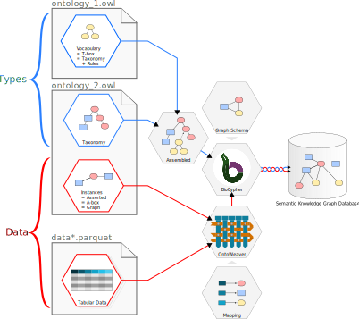
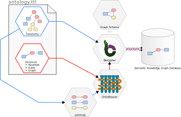

Iterable input data
-------------------

OntoWeaver iterates over input data, and creates nodes and edges at each steps.

The simplest example of iterable data is a table, which OntoWeaver will consume
line by line, creating node(s) and edge(s) at each step.

However, technically, OntoWeaver can consume any iterable data, providing that
it has an "Adapter" class knowing how to do it.

The more generic adapters run a query on a data file, which issue a set of
iterable data. For instance, you can run a XPath query on an XML document,
or a JMESPath query on a JSON file.

For a basic usage through the `ontoweave` command, OntoWeaver will guess the
input data type from the input file extension. Then, it will read the
``element`` (i.e. the same as ``column``) sections of the mapping as an input
query. In several query language, using a matching string already works. Thus,
for simple queries, you should not have much to do to consume a data file of a
supported type.

The following sections show the available input data adapters.

Tabular data
~~~~~~~~~~~~

Tables being the most ubiquituous data structure, they is used as the main
example across OntoWeaver documentation, as you may have seen in the previous
sections.

The basic processing of a table is to iterate over each row,
and map from column names to element types.

Tables can be in any format that Pandas can read.
The automatic input data type detection can handle the following
formats/extensions:
csv, tsv, txt,  xls, xlsx, xlsm, xlsb, odf, ods, odt, json, html, hdf,
feather, parquet, pickle, orc, sas, spss, stata.

Simple tables being the most common data format, we use it for all examples in
the :ref:`Mapping API` section.

Web Ontology data
~~~~~~~~~~~~~~~~~

Existing Semantic Knowledge Graphs are often distributed in files containing
the taxonomy of types, some logical predicates for reasonning and the graph of
individual instances itself.
These files are called "ontologies", and come in various formats and dialects.
The *de facto* standard for ontologies is the Web Ontology Language (
`OWL <https://en.wikipedia.org/wiki/Web_Ontology_Language>`_,
a superset of
`RDF <https://en.wikipedia.org/wiki/Resource_Description_Framework>`_).

Just as BioCypher can read a taxonomy from an ontology file,
OntoWeaver can iterate over the graph of individuals in an ontology file,
and import them as pieces of data.

.. note::
   Biocypher incorrectly calls *a taxonomy defined in an ontology file*
   "an ontology", for the sake of simplicity.

It may be confusing to have a clear view of how to handle ontology files.
They can host both the taxonomy (the "type labels") and a data graph.
As shown in the diagram below, the data parts are handled by OntoWeaver, while
the taxonomy part is handled by BioCypher.

What's confusing is that you may have to use the taxonomy from an ontology file,
but not its instances graph (it may not even have one!).
And you may even have to combine data from tabular files and an ontology's
instance graph, while also combining the taxonomies of several ontology files.

         OntoWeaver and BioCypher.

.. note::
   Ontologies specialists have specific terms for different parts of an
   ontology file. You may encounter "T-box" or "vacabulary", which means the
   taxonomy along with a set of logical rules.

   The "A-box" in an ontology file is the set (or "population") of "instances"
   (or "individuals"), which in BioCypher is just called a "graph".

For ontology specialists: OntoWeaver can import RDF triples which predicate is
``owl:NamedIndividual``.

OntoWeaver can read ontology files written in the RDF dialects that
`RDFlib <https://rdflib.readthedocs.io>`_ can read:
owl, xml, n3, turtle, ttl, nt, trig, trix, json-ld.

OWL & automap
^^^^^^^^^^^^^

The simplest way to read the input data from an ontology file is to use
the *automatic* OWL adapter.
This adapter can be used by passing the ``automap`` keyword in place of a mapping
file into the ``ontoweave`` command, or the ``weave`` function:

.. code:: sh

   ontoweave my_ontology.ttl:automap

This will automatically map the individuals defined into the input graph found
in the ontology file to the types found in the taxonomy of the *same* ontology
file.
Using this ``OWLAutoAdapter``, you thus don't need to define a mapping, it will
be automatically extracted from the input ontology file.

Of course, this adapter will expect that the classes defined in the input
ontology exist in the taxonomy configured by BioCypher.

.. note::
   BioCypher allows to assemble several taxonomies into a single one.
   This configured taxonomy should have the types that the graph loaded by
   OntoWeaver is using, or else a missing type error will occur.
   For instance, if you use a `root` type that's not the root of a
   (sub)taxonomy, a (possibly large) part of the (sub)taxonomy will be ignored
   by BioCypher, and thus invisible to OntoWeaver's extracted graph.

.. warning::
   This adapter cannot handle individuals inheriting from multiple classes,
   it will also ignore individuals without an `owl:class`.

Mapping OWL
^^^^^^^^^^^

In some case, you may want to change the types of some elements of a graph
stored in an OWL file.

With OntoWeaver, you can use a mapping file to change the types (*classes*,
in OWL) of the nodes (*instances*, in OWL) or edges (*object properties*,
in OWL) included in the graph within the OWL file, and make them match the ones
of the desired taxonomy in the output graph.

In most cases, you just need to define your mapping and use it on an OWL file:

.. code:: sh

   ontoweave my_ontology.ttl:my_mapping.yaml

In the mapping, you need to indicate which element of the
``owl:NamedIndividual`` you are using, with the ``element`` keyword, and to
what you want to map it.

.. note::

   The ``element`` keyword in a mapping is just a synonym for ``column``.
   This allows for a mapping file which is more readable to someone used
   to reading OWL ontologies.
   In practice, both keywords will work exactly the same.

Usually, you will want to map some "named individuals"
as a subject, and then map "object properties" via a relation.

.. warning::

   Do not confuse OWL's "object property" with OntoWeaver's "property".
   The term ``owl:ObjectProperty`` in your "populated" ontology refers to
   what OntoWeaver calls "edges".
   
   What OntoWeaver calls a "property" is referred by OWL as the term
   ``owl:DataProperty``.

If you need to call the adapter yourself, use the ``OWLAdapter`` class.

OWL Example
___________

Example of mapping working with an OWL file:

.. code:: yaml

    subject:
        map: # the subject is any OWL named individual...
            id_from_element: label
            match_type_from_element: type # which RDF type is...
            match:
                - source:
                    to_subject: source
                - target:
                    to_subject: target
    transformers:
        - map: # an ObjectProperty to another NamedIndividual:
            element: link
            to_object: target
            via_relation: link
        - map: # a property:
            element: prop
            to_property: prop

This mapping will extract the named individuals from the following OWL ontology
file (here in the Turtle syntax):

.. code::

    @prefix : <http://fake.onto#> .
    @prefix owl: <http://www.w3.org/2002/07/owl#> .
    @prefix rdf: <http://www.w3.org/1999/02/22-rdf-syntax-ns#> .
    @prefix rdfs: <http://www.w3.org/2000/01/rdf-schema#> .

    :thing a owl:Class ;
            rdfs:label "thing" .

    :source a owl:Class ;
            rdfs:subClassOf :thing ;
            rdfs:label "source" .

    :target a owl:Class ;
            rdfs:subClassOf :thing ;
            rdfs:label "target" .

    owl:ObjectProperty rdfs:subClassOf owl:thing .

    :link a owl:ObjectProperty ;
            rdfs:subClassOf :thing ;
            rdfs:label "link" .

    :prop a owl:DataProperty ;
            rdfs:subClassOf :thing ;
            rdfs:label "prop" .

    :S0 a :source ;
            a owl:NamedIndividual ;
            rdfs:label "S0" ;
            :link :T0 .

    :T0 a :target ;
            a owl:NamedIndividual ;
            rdfs:label "T0" ;
            :prop "data property" .

JavaScript Object Notation (JSON)
~~~~~~~~~~~~~~~~~~~~~~~~~~~~~~~~~

JSON data is ubiquituous in Web APIs. To extract data from JSON files,
OntoWeaver uses the `JMESPath query language <https://jmespath.org/>`_.

JMESPath is a mature query language that is well defined and documented, simple
queries are intuitive, and accessing iterable data is easy.
It also allows slicing, filtering data and multiselection of lists.
You will learn more by looking at the `JMESPath tutorial <https://jmespath.org/tutorial.html>`_.

JSON Example
^^^^^^^^^^^^

You will most probably want to extract data from a JSON list, which means you
will just need to understand the `wilcard expression <https://jmespath.org/specification.html#wildcards>`_.

Imagine that you have the following JSON document, containing a table:

.. code:: json

    {
        "data": [
            {"variant": 0, "patient": "A", "age": 12 },
            {"variant": 1, "patient": "B", "age": 23 },
            {"variant": 2, "patient": "C", "age": 34 }
        ]
    }

To extract its data with OntoWeaver, you can use the following mapping:

.. code:: yaml

    row:
       map:
           element: data[*].variant
           to_subject: variant
    transformers:
        - map:
            element: data[*].patient
            to_object: patient
            via_relation: patient_has_variant
        - map:
            element: data[*].age
            to_property: age
            for_object: patient

Note how the wilcard expression ``[*]`` will return *all* matching elements,
hence building an iterable data set. Right in the mapping, you can use filters,
for instance by using ``element: data[?age > 18].age``.

To work with more complex data (for instance nested data), you will want to
learn more about
`multi-select lists <https://jmespath.org/specification.html#multiselectlist>`_,
for which the `tutorial <https://jmespath.org/examples.html#working-with-nested-data>`_ have some
examples.

Extensible Markup Language (XML, HTML…)
~~~~~~~~~~~~~~~~~~~~~~~~~~~~~~~~~~~~~~~

XML data formats are ubuiquitous to word processors, and the Web in general (for
instance: HTML, ODF, DOCX are all XML dialects).
To extract XML data, OntoWeaver uses the
`ElementTree XPath query language <https://docs.python.org/3/library/xml.etree.elementtree.html#xpath-support>`_,
which is a small extension on top of the `XPath Web standard <https://www.w3.org/TR/xpath>`_.

HTML Example
^^^^^^^^^^^^

You will most probably want to extract data from tables encoded as nested XML
tags, which means you will just need to understand
`localization paths <https://www.w3.org/TR/xpath-3/#id-path-expressions>`_
and `numerical predicates <https://www.w3.org/TR/xpath-3/#id-predicate>`_.

Imagine that you have the followimg HTML page, containing a table:

.. code:: html

    <body>
        <table>
            <caption>Friends</caption>
            <thead>
                <tr><th>variant_id</th><th>patient</th><th>age</th></tr>
            </thead>
            <tbody>
                <tr><td>1</td><td>B</td><td>12</td></tr>
                <tr><td>0</td><td>A</td><td>23</td></tr>
                <tr><td>2</td><td>C</td><td>34</td></tr>
            </tbody>
        </table>
    <body>

To extract its data with OntoWeaver, you can use the following mapping:

.. code:: yaml

    row:
       map:
           element: /body/table/tbody/tr/td[1]
           to_subject: variant
    transformers:
        - map:
            element: /body/table/tbody/tr/td[2]
            to_object: patient
            via_relation: patient_has_variant
        - map:
            element: /body/table/tbody/tr/td[3]
            to_property: age
            for_object: patient

Note that XPath also allows `filtering <https://www.w3.org/TR/xpath-3/#id-filter-expression>`_.
