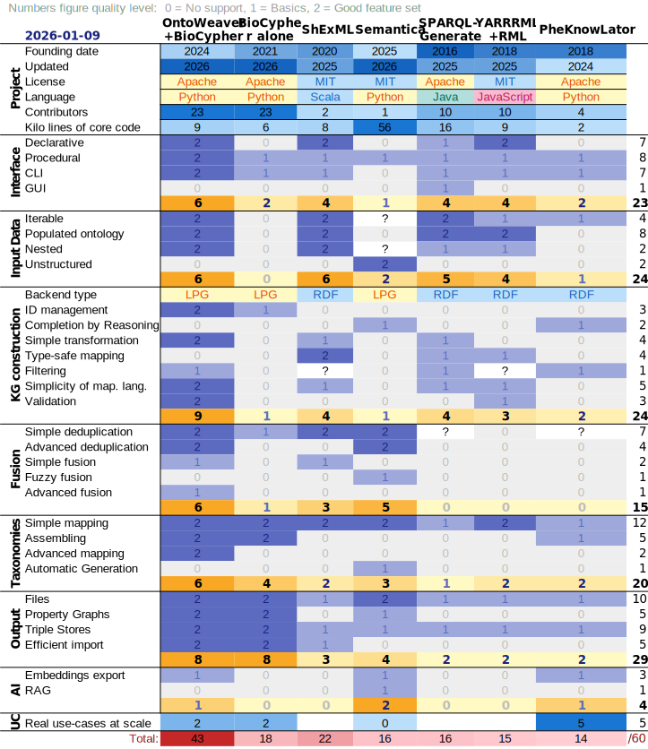

.. _comparison:

Why OntoWeaver and not another software?
----------------------------------------

There's a few software that provide features that are similar to the ones found
in OntoWeaver.

The market segment we're interested in here is software that allows to rapidly
*map* existing data into SKGs, so that one can try several graph *structures*
and find the one that fits a given problem.

However, our analysis is that none of the competitors has the feature set and
the ease of use that we needed to suits the need of our targeted end users.

In our case, we needed a *very simple* way of helping specialists involved in
"tumor boards" to make sense of their data. The first step involved integrate
numerous data sets in a single database, that closely ressemble the way the
specialists think of their data. To allows that, we needed a very simple
description of a mapping from the most common format (tables) into SKGs.

The following sections go into more details about why we think that OntoWeaver
(and its underlying base, BioCypher) forms the most promising approach.

Competitors
^^^^^^^^^^^

Among the software that we found [#]_, we selected the apt & stable projects,
and compared their features set.

From the Semantic Web community:

- `SPARQL-Generate <https://github.com/sparql-generate/sparql-generate>`_:
  probably the most ancient, based on the famous query language.
- `YARRRML <https://rml.io/yarrrml/>`_ (+ `RML <https://rml.io/>`_):
  which have an interesting declarative approach.
- `ShExML <https://github.com/herminiogg/ShExML>`_:
  the most recent in this field.

All of the software in the semantic web field target "triple-stores" databases
(in RDF).

From the biomedical community:

- `PheKnowLator <https://github.com/callahantiff/PheKnowLator>`_:
  a publication, tested on a lot of biomedical use-cases.
- `BioCypher <https://biocypher.org>`_:
  mainly focused on export backends.
- We discarded `PORI <https://github.com/bcgsc/pori/>`_,
  as it provides adapters that are very specific,
  but you may find the project interesting nonetheless.

Interestingly enough, all of the software in the biomedical community target
"labelled property graphs" databases (LPG).

From the AI community:

- `Semantica <https://hawksight-ai.github.io/semantica/>`_:
  totally vibe-coded, to the point of no return.

Overall comparison
^^^^^^^^^^^^^^^^^^

Here are the main evaluation points for each competitors:

ShExML:
    Has a good feature cover of accessing input data and making RDF graphs.
    Contrary to OntoWeaver, it allows type checking.
    However, it only support one export format (RDF, as usual in the Semantic
    Web field).

Semantica:
    It is very difficult to rigorously assess Semantica, because the code base
    is insanely complex and alarmingly large, for a realtively small feature set.
    The documentation is very difficult to understand for a human being.
    Our guess is that it is entirely coded with generative AI.
    From what we understand, the modules have been scraped by the AIg from
    existing projects (of which probably BioCypher, given the naming scheme),
    and one trivial feature has been implemented for each of them. It brings
    nevertheless interesting ideas, like clustering for deduplication and
    interfaces for natural language processing.

SPARQL-Generate:
    Has a Graphical User Interface, which may be useful for some people, albeit
    on that use-case it competes with `OpenRefine <https://openrefine.org/>`_,
    which is far superior. Its declarative language is powerful but very
    difficult to grasp and verbose.

YARRRML (+RML):
    Has a quite good declarative mapping language, quite readable and powerful.
    However, it lacks other features.

PheKnowLator:
    Has been tested on the largest set of applications, which is a real plus.
    However, it does not seem to have been developed by software engineers,
    and seems to be more a collection of scripts than a single software.
    It also has only the features that are necessary for its narrow application
    domain.

BioCypher alone:
    The only one focused on supporting many export formats, and allowing a simple
    way of assembling taxonomies. However, it does not provide any mapping
    language, but rely on Python code to parse the input data.
    The code machinery that's provided to implement "adapters" is quite complex.

Comparison method
^^^^^^^^^^^^^^^^^

We consider the following feature groups:

- the type of interface,
- features relatable to input data consumption,
- how the SKG is built,
- information fusion capabilities,
- how taxonomies are managed,
- exporting formats support,
- AI-related features.

For each feature in those groups, we give a score:

0. no support,
1. basic support,
2. good features set.

For each feature section, the sum of the scores gives a section score.
The sum of section scores gives an overall score.

Detailled features comparison
^^^^^^^^^^^^^^^^^^^^^^^^^^^^^

The following table enumerates the set of features covering the selected
software capabilities, along with how well each one implements such features.

    Comparison of features across several SKG creation software.

Conclusion: chose OntoWeaver
^^^^^^^^^^^^^^^^^^^^^^^^^^^^

A carrefullydesigned  mapping approach
~~~~~~~~~~~~~~~~~~~~~~~~~~~~~~~~~~~~~~

OntoWeaver brings a *very* simple (yet powerful enough) declarative mapping
approach. It has been tested by data analysts and is easy for them to understand.
Competitors approaches have languages that have either a compact ---and thus
difficult to read--- syntax (ShExML, YARRRML), either a verbose one
(SPARQL-Generate). We believe that OntoWeaver has a better compromise.

Competitor's declarative languages also try to broadly encompass procedural
features, like conditions and loops. We believe this is a desgin error.
Other softwares (BioCypher, Semantica) did go for a fully procedural approach,
using a real programming language. This allows any kind of data treatment, in
a context that's easy for most programmers. However, this produces very verbose
data adapters, that are difficult to grasp by looking at the code.

In OntoWeaver, we carefully chose to allow both approach, with a very simple
declarative approach first, but that can be complemented by a procedural one
if needed. The entry point for switching between one and the other is the
:ref:`transformer operator <common-mapping>`, which role is easy to understand.
OntoWeaver provides the necessary machinery to make its implementation easy, and
its limited context allows for anyone to grasp a transformer code immediately.

Export to several database formats
~~~~~~~~~~~~~~~~~~~~~~~~~~~~~~~~~~

Thanks to BioCypher, OntoWeaver can export to *quite a lot* of different databases
engines and file formats. In that regard, the pair is unique among competitors,
who almost all target a single output backend.

BioCypher's approach also targets efficiency, allowing to populate very large
database very rapidly (for instance by writing directly in the database's core
datastructure instead of using query script languages).

Easy taxonomy extension
~~~~~~~~~~~~~~~~~~~~~~~

BioCypher also brings an easy way to assemble and extend taxonomies, where
other competitors would require to edit the OWL files with third party tools,
which is not an easy task and require a good knowledge of ontology modelling.
In our use-cases, it proved much more useful to be able to borrow a part of
a taxonomy here and there, and to add a few classes where needed.

Easy reuse of existing adapters
~~~~~~~~~~~~~~~~~~~~~~~~~~~~~~~

OntoWeaver provides a state-of-the-art *high-level information fusion engine*,
a feature it is the only one to have. This module is based on state-of-the-art
academic work, and brings a very important feature: the possibility for data
*adapters* to be *independent* from each others.

When programming a data adapter with BioCypher, you have to make one adapter
for each SKG that you are building. BioCypher does its best to help you reuse
other's code to help you, but in practice, you still have to call and adapt the
third party modules.

With a fusion module, you can configure how the SKG elements are merged together,
with or without loss of information. Thus, the *reconcilation* step can be automated.
Most use-cases are easy enough so that OntoWeaver default approach (mergin the
properties of nodes with the same ID) is sufficient to
merge other adapters' data automatically.

But if a use-case necessitate a more complex approach, OntoWeaver allows to
configure the fusion strategies at various levels (for instance leveraging the
taxonomy to decide the type of a node).

OntoWeaver's fusion engine is also fully compatible with BioCypher "raw" adapters,
so that users can benefit from the existing set of adapters produced by the
community.

.. rubric:: Footnotes

.. [#]  A of 2026-01-09, date of this review.
