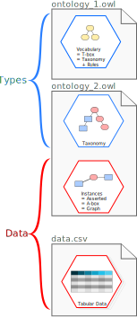

.. _basics_SKG:

Basics of Semantic Knowledge Graphs
-----------------------------------

If you wonder how to build a Semantic Knowledge Graph (with OntoWeaver), chances
are that you already know what it is.
But if you are a newcomer sent here by someone who knows but don't have the time
to explain, this section is for you.

.. caution::

    This introduction targets explaining the *bare minimum* to understand what
    OntoWeaver is doing. It avoids a lot of the theory and practice of the
    related scientific fields, like graph theory or semantic web.

What is a *Graph*?
^^^^^^^^^^^^^^^^^^

A graph is a data structure consisting of a set of objects where some pairs of
the objects are in some sense "related". The objects are represented by
abstractions called "vertices" (also called "nodes") and the link between each of the related
pairs of vertices is called an "edge".

When showed on a diagram, a graph is depicted as a set of circles (the nodes),
some of which are joined by lines (the edges).
Classicaly, nodes are shown with a text identifier (their "name", or "ID"),
but edges are not (albeit they may have one ID).

Here is a graph of diseases and drugs, for instance:

.. graphviz::
   :caption: A diagram figuring a graph.

   digraph {
       fontname="Courier New"

       Insomnia   -> Doxylamine
       Allergies  -> Doxylamine
       Insomnia   -> Duloxetine
       "Clinical depression" -> Duloxetine
   }

In most cases, nodes are represented as circles. When programming, they are
often represented by parentheses, e.g. ``(Insomnia) -> (Doxylamine)``.

What is a *Knowledge* Graph?
^^^^^^^^^^^^^^^^^^^^^^^^^^^^

A *knowledge* graph (KG) is a graph that carries data on its nodes and edges.
For instance, nodes and labels can carry a "label" that represents their *type*,
or any data property that means something.

Below is our graph of diseases and drugs, which shows the *type* of its nodes and
edges, along with the IDs of its nodes.
Note that any kind of property can be attached to a knowledge graph element,
like the "form" one, attached here to the drug nodes:

.. graphviz::
   :caption: A diagram figuring a knowledge graph.

   digraph {
       fontname="Courier New"

       Doxylamine [label="Doxylamine\ntype:drug\nform:pills"]
       Duloxetine [label="Duloxetine\ntype:drug\nform:pills"]
       Insomnia   [label="Insomnia\ntype:disease"]
       Allergies  [label="Allergies\ntype:disease"]
       Depression [label="Clinical depression\ntype:disease"]

       Insomnia   -> Doxylamine [label="type:treatable_by"]
       Allergies  -> Doxylamine [label="type:treatable_by"]
       Insomnia   -> Duloxetine [label="type:treatable_by"]
       Depression -> Duloxetine [label="type:treatable_by"]
   }

Such a graph with properties attached to its elements is sometime called a
"property graph".

When programming, we often see representations like:
``(Insomnia:disease)--[:treatable_by]->(Doxylamine:disease)``.

What is a *Semantic* Knowledge Graph?
^^^^^^^^^^^^^^^^^^^^^^^^^^^^^^^^^^^^^

A *semantic* knowledge graph (SKG) is a knowledge graph that works with a
voccabulary.
The vocabulary if made of a "taxonomy" of types (sometimes called "classes")
and a set of properties associated to each type.

The *taxonomy* is a hierarchical data structure (often
a "tree") that represents types of increasing abstraction.
The hierarchical structure defines a (sometimes partial)
order among the set of types.

The set of *properties* associated to a type defines the intrinsic properties
that an object has when it belongs to this type (class).

For instance, an "insomnia" is a kind of "sleep disorder", which in turn is a
sub-type of "disease". Taxonomies are classically represented the same way than
a directory tree is shown in your everyday files manager, or a nested bullet
list:

.. code-block::

    thing
    ├─ entity
    │  ├─ Drug
    │  │  ├─ Antihistamines 
    │  │  └─ SNRI
    │  └─ Disease
    │     ├─ Sleep disorder
    │     ├─ Immune response disorder
    │     └─ Mental disorder
    └─ association
       └─ sensible_to
          └─ treatable_by

In an SKG, it is possible to have a single taxonomy defining types for both
nodes and edges.

.. graphviz::
   :caption: A diagram figuring a semantic knowledge graph.

   digraph {
       fontname="Courier New"

       Doxylamine [label="Doxylamine\ntype:\l thing\l └ entity\l    └ Drug\l       └ Antihistamines\nform:pills"]
       Duloxetine [label="Duloxetine\ntype:\l thing\l └ entity\l    └ Drug\l       └ SNRI\nform:pills"]
       Insomnia   [label="Insomnia\ntype:\l thing\l └ entity\l    └ Disease\l       └ Sleep disorder"]
       Allergies  [label="Allergies\ntype:\l thing\l └ entity\l    └ Disease\l       └ Immune response disorder"]
       Depression [label="Clinical depression\ntype:\l entity\l └ entity\l    └ Disease\l       └ Mental disorder"]

       Insomnia   -> Doxylamine [label="type:\l  thing\l   └ association\l      └ sensible_to\l         └ treatable_by"]
       Allergies  -> Doxylamine [label="type:\l  thing\l   └ association\l      └ sensible_to\l         └ treatable_by"]
       Insomnia   -> Duloxetine [label="type:\l  thing\l   └ association\l      └ sensible_to"]
         Depression -> Duloxetine [label="type:\l  thing\l   └ association\l      └ sensible_to\l         └ treatable_by"]
   }

Note that the graph elements carry all their "parent" types, along with the
"terminal" type (sometime called "leaf type", in reference to the taxonomy
being a *hierarchy*). Nodes and edges may have properties, usually in the
form of *key:value* pairs (like ``form:pills`` here).

Why do we want SKGs?
^^^^^^^^^^^^^^^^^^^^

.. tip::

    Semantic Knowledge Graphs are a way to represent and store a set of information
    in a *database* that is very flexible, extensible and easy to query.

You may already know that there are several types of databases, among which the
"relational databases" are the most pervasive. In a relational database, objects
of interests are represented as *rows* in *tables*, and some *columns* serves
as "index" that links tables.

In a way, rows are like nodes, and index are like edges, while other columns
are like properties.

.. note::

    Theroretically, you can represent the exact same database in both paradigms,
    without losing any information. However, one may be more or less intuitive
    for you to use in your specific context.

Explaining all the pros and cons of SKG against relational databases is beyond
the scope, but here are elements supporting why an SKG would be a better choice
for you than a relational database:

* SKGs are more intuitive for representing some objects, which a human would
  naturally think as a graph. For instance a collection of things linked in a
  network, or chains of causal relationships.
* Modern SKG engines are as efficient as their relational counterparts.
* SKGs are very easy to extend, and adding nodes and/or properties does not
  drastically change the way you query the data.
* Queries can leverage the taxonomy very easily.
* Overall, we find queries on SKG to be more easy to state (especially with
  the GQL language) than their counterpart (using SQL, for instance).

For example, here is a GQL query meaning "show me all the drugs for which there
is a sensitivity to a sleep disorder":

.. code-block:: cypher

    MATCH (s:Sleep disorder)-[:sensitive_to]->(d:Drug) RETURN d.label

And its SQL counterpart:

.. code-block:: sql

    SELECT d.label FROM Drug d JOIN Disease s ON s.sensitive_to = d.id WHERE s.type LIKE "%Sleep disorder%"
    -- Assuming that the "type" columns aggregates all parent types in a string.

And that is just for a *simple* query.

Where can I get taxonomies for my SKG?
^^^^^^^^^^^^^^^^^^^^^^^^^^^^^^^^^^^^^^

The first community to have produced tools around this idea of graphs carrying
structured data gravitates around the idea of "semantic web". As such, several
of their tools became some kind of standard. That's the case of "ontologies".

Nowadays, most of the useful taxonomies thus come in the form of ontology
files.

What is an *Ontology*?
^^^^^^^^^^^^^^^^^^^^^^

If we restrict its definition to the use made in computer science,
an *ontology* is generally a file, carrying both a vocabulary
(both the "taxonomy" and the set of "properties")
and an SKG (a "populated graph"). Less often, it also carry a set of logical
predicates modelling constraints, for instance about what type of node can be
connected to what other type of node.

    Ontology files can contain a taxonomy (and thus "types", in blue),
    and an SKG (and thus "data", in red).

To do so, an ontology file is taking a very generic approach: everything there
is modelled as a "triple": a (subject) is linked by a [predicate] to an (object).
This means that *everything in an ontology* is represented by:
``(subject)--[predicate]->(object)``. Nodes are subjects or objects, edges are
predicates. But "node having a type" is also represented as a triple:
``(my node)--[is a]->(my type)``.

What is *Turtle*?
~~~~~~~~~~~~~~~~~

There are several formats with different syntaxes to write down ontology files,
but we will only see here the "turtle" one, which is the most readable by a
human being. In turtle, a triple is written as a "sentence":

.. code-block:: ttl

    # The dot indicate the end of the sentence.
    subject predicate object .

Turtle also provides a short syntax to apply several predicate to the same
subject:

.. code-block:: ttl

    subject predicate1 object1 ;  # The semicolon indicate a part of the sentence.
            predicate2 object2 .

For instance, this is a valid turtle section:

.. code-block:: ttl

    my_node a my_disease ;  # "a" meaning "is a".
            label "My Node" .  # "label" having some pre-defined meaning.

What is *OWL*?
~~~~~~~~~~~~~~

*OWL* is a ---slightly eccentric--- accronym for "Web Ontology Language".
The "language" it refers to is a pre-defined set of predicates and types
(hence the term "vocabulary").
This language defines how to *model* a SKG, using a standardized vocabulary
on which everyone can agree.

But in fact, OWL is built up on top of *two* other standards:

1. the Resource Description Framework (RDF),
2. the RDF Schema (RDFS).

Of course, RDFS is a vocabulary that sits on top of RDF, with a carefully chosen
---and not at all confusing--- name.

.. seealso::
    Technically, RDF and RDFS bring a method of modelling, and OWL brings the
    vocabulary that is necessary for *reasoning* over "description logics".
    Reasoning is beyond the scope of this introduction, but it may be useful for
    users as a way to *check* the validity of an SKG (e.g. raise an error if a node
    is linked to too many nodes, or if a node type is illogical), or
    *complete* an SKG with *missing data* (e.g. a missing reverse edge,
    or a missing "is a" edge toward a class).

There's a lot theoretical stuff that's explained in all those specifications,
but in a nutshell, here is what each vocabulary is bringing that is of
interest for this introduction:

1. RDF:

    * ``rdf:type``: a predicate meaning "the subject *is a* object" In turtle,
      it can be typed as "a". This means that the subject is *an instance* of
      this type.
    * ``rdf:Class``: a type representing a... type. If you type
      ``Disease a rdf:Class``, that means that "Disease" is a type. So that
      you can type ``Insomnia a Disease``. But note that "Insomnia" is not a
      class, it is an *instance* of the "Disease" class.
    * ``rdf:Property``: a relationship between an instance and either another
      instance, either an atomic piece of data (i.e. a number or a string).
      That is a special kind of class, in a way.

2. RDFS:

    * ``rdfs:subClassOf``: a predicate necessary for building a taxonomy. That
      is, a hierarchy of classes.
    * ``rdfs:subPropertyOf``: the predicate for building a taxonomy of
      *property* classes.
    * ``rdfs:label``: the textual representation of any subject. That's necessary,
      because all subjects are identified by a Universal Resource Identifier
      (URI, sometimes you will see the old term "IRI"), which is essentially
      a URL.

3. OWL:

    * ``owl:Thing``: the root of all classes in every taxonomies.
    * ``owl:sameAs``: a predicate meaning that the subject is *the same* as the
      object.
    * ``owl:NamedIndividual``: an object indicating that the subject is an instance.
    * ``owl:ObjectProperty``: a type for edges linking two nodes.
    * ``owl:DatatypeProperty``: a type of "edge" between a node and a piece of
      information. Remember that here, everything is a triple.

.. warning::

    There is an easy confusion to make between ``owl:ObjectProperty`` and what
    we called "properties" in a SKG. Note that an ``owl:ObjectProperty`` is
    actually akin to an **edge**. It is ``owl:DatatypeProperty`` that is a
    **property** in an SKG.

.. note::

    An "instance" is ---more or less--- the same as an individual, in the sense
    that it's a node carrying some actual information about an object out there,
    in the real world. OWL calls the set of individual a "population", for
    instance, which is the same than what we call an SKG.

    In an ontology *file*, you may find both an SKG and a taxonomy. Semantic
    web experts sometimes refer to the SKG as the "A-box" (the set of *asserted*
    pieces of information), and the taxonomy as the "T-box" (the set of *types*).

Why do we need OWL?
^^^^^^^^^^^^^^^^^^^

All these predicates forms a vocabulary that is common to everyone, and allows
people to define an ontology for others to use. An ontology is thus first a tool
for experts to indicate *how a field of interest shoud model its objects*.

There are a lot of different ways to model something with OWL.
For most of users, the most useful element is the taxonomy.

.. important::

    Note, however, that it always goes with *a modelling method*, that you may have
    to learn in order to understand how to split your objects of interests in
    atomic pieces, and how to apply the taxonomy!

For instance, you will very often face the question: should this information be
modelled *as a node* or *as a property*? Usually, the people having made the
taxonomy that you are using have the answer. Read their documentation!

Why do I need OntoWeaver to make an SKG?
^^^^^^^^^^^^^^^^^^^^^^^^^^^^^^^^^^^^^^^^

OntoWeaver is a tool that shines if you need to build up an SKG that:

* is integrating several heterogeneous data sources,
* is automatically built, in a reproducible way,
* allows using independent data sources, for which import scripts and taxonomies
  have been made by other people,
* allows fine-grained configuration.

If you feel those features are necessary for your use-case, read the remaining
sections of this documentation!

