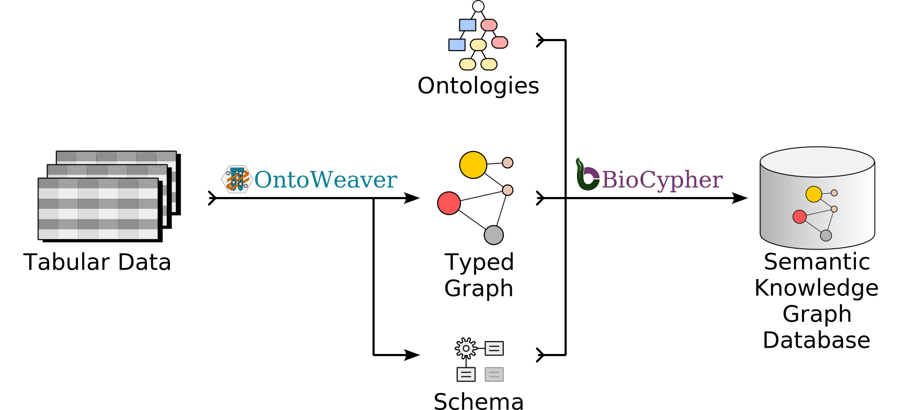

Introductions
-------------

.. _intro-beginners:

Introduction for beginners
^^^^^^^^^^^^^^^^^^^^^^^^^^

OntoWeaver allows extracting data from files in the most commons data formats,
and convert them into "knowledge graphs".
Konwledge graphs are sets of nodes, linked with edges to other nodes.
Those nodes and edges have types, and carry data "properties" with them.

With OntoWeaver, you can automatize the extraction of data from tabular files
or documents, and the creation of large knowledge graphs in various formats.
This makes OntoWeaver an effective tool for creating knowledge graphs in a
reproducible way.

OntoWeaver aims at being usable by users that are not professional programmers.
The "mapping" that defines which data to extract in which node is readable
by anyone understanding their data.

OntoWeaver also allows those mappings to be interroperable with "ontologies"
made by experts for describing how to represent an object of interest.
Those ontologies define a hierarchy of types, that can be applied on nodes and
edges, so that you can later ask questions like "which types of drugs can treat
this type of diseases?".

For instance, imagine you have a table showing which disease can be treated by
which drug:

+------------+------------+
| DISEASE    | DRUG       |
+------------+------------+
| Insomnia   | Doxylamine |
+------------+------------+
| Allergies  | Doxylamine |
+------------+------------+

You will then define how this data can be transformed into nodes and edges by
writing a mapping file, looking like:

.. code:: yaml

   row: # The meaning of a row in the input CSV file.
      map:
         column: DISEASE # The name of a a column in your table.
         to_subject: disease # The type used in the ontology.

   transformers:  # How to map cells to nodes and edges.
       - map:  # Map a column to a node.
           column: DRUG
           to_object: drug
           via_relation: treatable_by # The type of link between diseases and drugs in the ontology.

You then run a command to transform your data in an SKG:

.. code:: sh

   ontoweave my_data.csv:my_mapping.yaml

Which will create a graph:

.. graphviz::

   digraph {
       Insomnia ->  Doxylamine [label=treatable_by]
       Allergies -> Doxylamine [label=treatable_by]
   }

.. _intro-skilled:

Introduction for skilled users
^^^^^^^^^^^^^^^^^^^^^^^^^^^^^^

OntoWeaver is a tool for importing iterable data (tables, documents, etc.)
in Semantic Knowledge Graphs (SKG) databases.

For instance, OntoWeaver allows writing a simple YAML mapping to express
how items from an iterable dataset (e.g. a CSV table, or a JSON file, etc.)
are to be converted as *typed* nodes or edges in an SKG.

Each node and edge can have data associated to it, in the form of "properties".

The types come from the taxonomy within an ontology file, so that it's easier
to design queries to get a subgraph from the graph database.

To map tabular data, this would look like:

.. code:: yaml

   row: # The meaning of an entry in the input table.
      map:
         column: <column name in your CSV>
         to_subject: <ontology node type to use for representing a row>

   transformers:  # How to map cells to nodes and edges.
       - map:  # Map a column to a node.
           column: <column name>
           to_object: <ontology node type to use for representing a column>
           via_relation: <edge type for linking subject and object nodes>
       - map:  # Map a column to a property.
           column: <another name>
           to_property: <property name>
           for_object: <type holding the property>
       - split:  # Map each element contained in each cell, separated by ";".
            separator: ";"
            column: <another column>
            to_object: <another node type>
            via_relation: <yet another edge type>

   metadata:  # Optional properties added to every node and edge.
       - source: "My OntoWeaver adapter"
       - version: "v1.2.3"

You then run a command to transform all your data files in an SKG, and insert it
in the graph database of your choice:

.. code:: sh

   ontoweave my_data.csv:my_mapping.yaml other_data.tsv:my_mapping.yaml --run-import-file

.. _intro-experts:

Introduction for experts
^^^^^^^^^^^^^^^^^^^^^^^^

OntoWeaver is a tool to map queriable iterable data into a Labelled Knowledge
Graph, which labels are extracted from an OWL ontology's taxonomy.
The ontology can be composed from subtrees of several taxonomies.

The mapping uses a declarative language with a YAML syntax.
OntoWeaver comes with several predefined mapping "transformers"
and can be extended by independant procedural code if needed.

The mappings can be applied to several iterable data structure: either any kind
of table that can be loaded with Pandas (CSV, spreadsheets, etc.), or structure
documents that can be queried (XML dialects, JSON, or OWL, for instance).

Note that OntoWeaver delegates filtering to query languages (e.g. XPath,
JMESPath or regular expressions).

The mapping references leaf types of the assembled ontology, and the engine will
project all the ancestors in the assembled taxonomy onto the nodes and edges.
We support several output backends, not just labelled knowledge graphs.
Some output backend will keep the full T-box (like OWL),
some will project only the set of ancestors (NetworkX),
some will only use the leaf type (Neo4j, on its edges).

Each element of the graph can carry key-value pairs, named "properties", which
are semantically similar ---albeit technically different for several backends---
to OWL's DataProperties.

Technically, OntoWeaver provides a simple layer of abstraction on top of
`BioCypher <https://biocypher.org>`__, which remains responsible for
doing the ontology assembling, supporting several graph database
backends, and allowing reproducible & configurable builds.

However, with OntoWeaver, you can design adapters that:

1) take less line of codes,
2) are readable by non-programmers,
3) are independent from each other, and can be combined.

To combine independent adapters, OntoWeaver uses a high-level information
fusion engine which can be configured to your needs.
Our fusion engine is one of our killer feature, as it allows you to call
adapters made by third parties, and integrate their data in a single database,
without much configuration.

          be integrated in a single SKG, thanks to the fusion engine.

