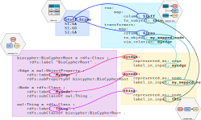

Mapping API
-----------

OntoWeaver essentially creates a Biocypher adapter from the description
of a mapping from a table to ontology types. As such, its core input is
a dictionary, that takes the form of a YAML file. This configuration
file indicates:

- to which (node) type to map each line of the table,
- to which (node) type to map columns of the table,
- with which (edge) types to map relationships between nodes.

How are config files related?
^^^^^^^^^^^^^^^^^^^^^^^^^^^^^

It may be difficult to understand how the type tags indicated in OntoWeaver's
*mapping* are related to the types indicated in BioCypher's *schema*.

In the schema, the header of a block is the RDFS label that lies in the
taxonomy of the ontology file, while the ``label_in_input`` is a kind of tag
that is written in the mapping, after a keyword (e.g. ``to_object``).

.. hint::

    OntoWeaver can automatically generate a schema file from your mapping,
    if you just need to have a one-to-one parity of type names.
    With that feature, you need to map the input data items to the
    taxonomy's terms directly.
    That way you can just forget about having to write a schema file, in most
    cases.
    See ontoweave's `--auto-schema` parameter, or the `oncoweave.autoschema`
    function.

As shown in the figure below, the column headers in the *input data*
are linked to the type tag in the *mapping*, which are linked to the ontology
classes in the *schema*.

   Four files represented as blocks with links between equivalent keywords.

.. note::

   While not strictly necessary, it is often the case that people use
   the very same name for both the taxonomy classes in the schema
   and the type tags in the mapping; to ease the reading of config files.
   But if you integrate data using pre-made adapters, it can be useful to
   write your own schema to align terms.

Common Mapping
~~~~~~~~~~~~~~

The following explanations assume that you are familiar with `Biocypher’s
configuration <https://biocypher.org/tutorial-ontology.html>`__, notably
how it handles ontology alignment with schema configuration.

The minimal configuration would be to map lines and one column, linked
with a single-edge type.

For example, if you have the following CSV table of phenotypes/patients:

::

   phenotype,patient
   0,A
   1,B

and if you target the Biolink ontology, using a schema configuration
(i.e. subset of types), defined in your ``schema_config.yaml`` file, as
below:

.. code:: yaml

   phenotypic feature:
       represented_as: node
       label_in_input: phenotype
   case:
       represented_as: node
       label_in_input: case
   case to phenotypic feature association:
       represented_as: edge
       label_in_input: case_to_phenotype
       source: phenotypic feature
       target: case

you may write the following mapping:

.. code:: yaml

   row:
      rowIndex:
         # No column is indicated, but OntoWeaver will map the indice of the row to the node name.
         to_subject: phenotype
   transformers:
       - map:
           column: patient # Name of the column in the table.
           to_object: case # Node type to export to (most probably the same as in the ontology).
           via_relation: case_to_phenotype # Edge type to export to.

This configuration will end in creating a node for each phenotype, a
node for each patient, and an edge for each phenotype-patient pair:

::

             case to phenotypic
             feature association
                       ↓
              ╭───────────────────╮
              │              ╔════╪════╗
              │              ║pati│ent ║
              │              ╠════╪════╣
   ╭──────────┴──────────╮   ║╭───┴───╮║
   │phenotypic feature: 0│   ║│case: A│║
   ╰─────────────────────╯   ║╰───────╯║
                             ╠═════════╣
   ╭─────────────────────╮   ║╭───────╮║
   │          1          │   ║│   B   │║
   ╰──────────┬──────────╯   ║╰───┬───╯║
              │              ╚════╪════╝
              ╰───────────────────╯

Available Transformers
^^^^^^^^^^^^^^^^^^^^^^

If you want to transform a data cell before exporting it as one or
several nodes, you will use other *transformers* than the “map” one.

map
~~~

The *map* transformer simply extracts the value of the cell defined, and
is the most common way of mapping cell values.

For example:

.. code:: yaml

       - map:
           column: patient
           to_object: case

Although the examples usually define a mapping of cell values to nodes,
the transformers can also used to map cell values to properties of nodes
and edges. For example:

.. code:: yaml

       - map:
           column: version
           to_property: version
           for_objects:
               - patient # Node type.
               - variant
               - patient_has_variant # Edge type.

split
~~~~~

The *split* transformer separates a cell value into several
items, and then inserts a node for each element of the list.

If the cell value is a string, it uses the ``separator`` parameter to split
it.

If the cell value is any other type, it tries to iterate over it.
In this case, any iterable object can be in the cell.

For example, if you have a list of treatments separated by a semicolon,
you may write:

.. code:: yaml

   row:
      map:
         to_subject: phenotype
   transformers:
       - map:
           column: variant
           to_object: variant
           via_relation: phenotype_to_variant
       - split:
           column: treatments
           from_subject: variant
           to_object: drug
           via_relation: variant_to_drug
           separator: ";"

::

        phenotype to variant      variant to drug
                ↓                       ↓
          ╭───────────────╮   ╭────────────────╮
          │         ╔═════╪═══╪═╦══════════════╪═════╗
          │         ║ vari│ant│ ║  treatments  │     ║
          │         ╠═════╪═══╪═╬══════════════╪═════╣
          │         ║     │   │ ║variant       │     ║
          │         ║     │   │ ║to drug       │     ║
   ╭──────┴─────╮   ║╭────┴───┴╮║  ↓    ╭──╮ ╭─┴────╮║
   │phenotype: 0│   ║│variant:A├╫───────┤ X│;│drug:Y│║
   ╰────────────╯   ║╰─────────╯║       ╰┬─╯ ╰──────╯║
                    ╠═══════════╬════════╪═══════════╣
   ╭────────────╮   ║╭─────────╮║       ╭│ ╮ ╭──╮    ║
   │      1     │   ║│    B    ├╫────────╯X ;│ Z│    ║
   ╰──────┬─────╯   ║╰────┬───┬╯║       ╰  ╯ ╰─┬╯    ║
          │         ╚═════╪═══╪═╩══════════════╪═════╝
          ╰───────────────╯   ╰────────────────╯

cat
~~~

The *cat* transformer concatenates the values cells of the defined
columns and then inserts a single node. For example, the mapping below
would result in the concatenation of cell values from the columns
``variant_id``, and ``disease``, to the node type ``variant``. The
values are concatenated in the order written in the ``columns`` section.

.. code:: yaml

   row:
      cat:
         columns: # List of columns whose cell values are to be concatenated
           - variant_id
           - disease
         to_subject: variant # The ontology type to map to

cat_format
~~~~~~~~~~

The user can also define the order and format of concatenation by
creating a ``format_string`` field, which defines the format of the
concatenation. For example:

.. code:: yaml

   row:
      cat_format:
         columns: # List of columns whose cell values are to be concatenated
           - variant_id
           - disease
         to_subject: variant # The ontology type to map to
         # Enclose column names in brackets where you want their content to be:
         format_string: "{disease}_____{variant_id}"

nested
~~~

The *nested* transformer can access values in nested key-value store.
For instance, if your table cells contains a Python dictionary,
or a Pandas one-dimensional DataFrame, or a flat JSON object string,
*nested* will be able to access a value into it.

For instance, if your table looks like:

+------+----------------------+
| LINE | WORDS                |
+======+======================+
|   0  | {"en": "good"}       |
+------+----------------------+
|   1  | {"en": "awesome"}    |
+------+----------------------+

Then, you will want to access first the column named "WORDS", and the key
named "en" in the nested JSON object.

To do so with *nested*, you need to indicate the *sequence* of keys, in the order
of the nesting. For instance:

.. code:: yaml

    transformers:
        - nested:
            keys:
                - WORDS
                - en
            to_object: word  # The usual.
            via_relation: has_word

.. note::

   The *nested* transformer can detect and parse JSON object notation, but if the
   nested cell value is not a string, it will try to access it with the bracket
   syntax, e.g. ``value[key]``. This should be enough to allow it to use a large
   number of data structures.

split_nested
~~~~~~~~~~~~

This transformer is a combination of ``split`` and ``nested``.
It first *splits* the cell value, and then on each item,
allows to access elements in a *nested* data structure.

For instance, imagine that your table contains Python lists, themselves containing
dictionaries:

+------+-----------------------------------------+
| ITEM | WORDS                                   |
+======+=========================================+
|   1  | [{"en": "good"},{"fr": "bien"}]         |
+------+-----------------------------------------+
|   2  | [{"en": "awesome"},{"de": "wunderbar"}] |
+------+-----------------------------------------+

Then, you will want to access first the column named "WORDS", and the key
named "fr" or "de" in the nested JSON object.

To do so, you will map:

.. code:: yaml

    transformers:
        - split_nested:
            # No need to indicate a separator if the cell value is a list.
            keys:
                - WORDS  # The column name.
                - fr     # The nested key.
            to_object: word  # The usual.
            via_relation: has_word

.. note::

   If the nested key does not exists, this transformer will silently skip the
   row and this will not create any node or property.

string
~~~~~~

The *string* transformer allows mapping the same pre-defined static
string to properties of *some* nodes or edge types.

It only needs the string *value*, and then a regular property mapping:

.. code:: yaml

   - string:
       value: "This may be useful"
       to_property: comment
       for_objects:
           - patient
           - variant

translate
~~~~~~~~~

The *translate* transformer changes the targeted cell value from the one
contained in the input table to another one, as configured through
(another) mapping, extracted from (another) table.

This is useful to *reconciliate* two sources of data using two different
references for the identifiers of the same object. The translate
transformer helps you translate one of the identifiers to the other
reference, so that the resulting graph only uses one reference, and
there is no duplicated information at the end.

For instance, let’s say that you have two input tables providing
information about the same gene, but one is using the HGCN names, and
the other the Ensembl gene IDs:

===== =============
Name  Source
===== =============
BRCA2 PMID:11207365
===== =============

=============== ============
Gene            Organism
=============== ============
ENSG00000139618 Mus musculus
=============== ============

Then, to map a gene from the second table (the one using Ensembl), you
would do:

.. code:: yaml

   - translate:
       column: Gene
       to_object: gene
       translations:
           ENSG00000139618: BRCA2

Of course, there could be hundreds of thousands of translations to
declare, and you don’t want to declare them by hand in the mapping file.
Fortunately, you have access to another table in a tabular file, showing
which one corresponds to the other:

=============== ===== ========
Ensembl         HGCN  Status
=============== ===== ========
ENSG00000139618 BRCA2 Approved
=============== ===== ========

Then, to declare a translation using this table, you would do:

.. code:: yaml

   - translate:
       column: Gene
       to_object: gene
       translations_file: my_tabular_file.ext
       translate_from: Ensembl
       translate_to: HGCN

.. note::

   The ``translate`` transformer allows ``translations_file`` to be any tabular file
   format that can be loaded by OntoWeaver. In most cases, this means
   anything that can be loaded by Pandas. However, you may have to pass additional
   arguments to the (Pandas') load function in some edge cases. To do so, just
   add them to your mapping file. For instance:

.. code:: yaml

   - translate:
       column: Gene
       to_object: gene
       translations_file: myfile.csv.zip
       translate_from: Ensembl
       translate_to: HGCN
       sep: ";"
       compression: zip
       decimal: ","
       encoding: latin-1

.. note::
   
   You can use the "glob" feature to load multiple files to form your translation
   table. For example: ``translations_file: my_table-part*.parquet``.

replace
~~~~~~~

The *replace* transformer allows the removal of forbidden characters
from the values extracted from cells of the data frame. The pattern
matching the characters that are *forbidden* characters should be passed
to the transformer as a regular expression. For example:

.. code:: yaml

   - replace:
       columns:
           - treatment
       to_object: drug
       via_relation: alteration_biomarker_for_drug
       forbidden: '[^0-9]' # Pattern matching all characters that are not numeric.
       # Therefore, you only allow numeric characters.
       substitute: "_" # Substitute all removed characters with an underscore, in case they are
       # located inbetween allowed_characters.

Here we define that the transformer should only allow numeric characters
in the values extracted from the *treatment* column. All other
characters will be removed and substituted with an underscore, in case
they are located inbetween allowed characters.

By default, the transformer will allow alphanumeric characters (A-Z,
a-z, 0-9), underscore (\_), backtick (\`), dot (.), and parentheses (),
and the substitute will be an empty string. If you wish to use the
default settings, you can write:

.. code:: yaml

   - replace:
       columns:
           - treatment
       to_object: drug
       via_relation: alteration_biomarker_for_drug

Let’s assume we want to map a table consisting of contact IDs and phone
numbers.

======== ============
id       phone_number
======== ============
Jennifer 01/23-45-67
======== ============

We want to map the ``id`` column to the node type ``id`` and the
``phone_number`` column to the node type ``phone_number``, but we want
to remove all characters that are not numeric, using the default
substitute (““), meaning the forbidden characters will only be removed,
and not replaced by another character. The mapping would look like this:

.. code:: yaml

   row:
       map:
           column: id
           to_subject: id
   transformers:
       - replace:
           column: phone_number
           to_object: phone_number
           via_relation: phone_number_of_person
           forbidden: '[^0-9]'

The result of this mapping would be a node of type ``phone_number``,
with the id of the node being ``01234567``, connected to a node of type
``id`` with the id ``Jennifer``, via an edge of type
``phone_number_of_person``.

boolean
~~~~~~~

The *boolean* transformer can map any set of values onto a boolean pair.

It considers a set of truth values, along with a set of falsehood values,
and then set the node ID to the user's true or false value.

If no configuration is given for ``consider_true`` and ``consider_false``,
OntoWeaver will use Python's `bool(value)`` to assert the truth of the value
passed from the cell.

If ``output_true`` or ``output_false`` are omitted, they will default to "True"
and "False".

For instance:

.. code:: yaml

    - boolean:
        column: my_column
        via_relation: my_relation
        consider_true:
            - Y
            - Yes
            - yes
        output_true: my_truth
        consider_false:
            - N
            - No
            - no
        output_false: my_falsehood

Is equivalent to:

.. code:: python

    if value in ["Y", "Yes", "yes"]:
        yield "my_truth"
    elif value in ["N", "No", no"]:
        yield "my_falsehood"
    else:
        raise exceptions.TransformerConfigError("Unknown value")

Case manipulation transformers
~~~~~~~~~~~~~~~~~~~~~~~~~~~~~~

The following transformers can change the case of the string within the cells:

- ``lower``: change all letters to lowercase,
- ``upper``: change all letters to uppercase,
- ``capitalize``: change the first letter to uppercase,
- ``lower_capitalize``: change all letters to lowercase, then the first letter
  to uppercase.

Advanced type management
^^^^^^^^^^^^^^^^^^^^^^^^

Map the same item to several types depending on its value with `match`
~~~~~~~~~~~~~~~~~~~~~~~~~~~~~~~~~~~~~~~~~~~~~~~~~~~~~~~~~~~~~~~~~~~~~~

In some cases there might be a need to apply multiple type mappings to
cell values within a single column. For example, having the table below:

+------+--------------+
| LINE | WORDS        |
+======+==============+
|   0  | sensitive    |
+------+--------------+
|   1  | sensitivity  |
+------+--------------+
|   2  | productive   |
+------+--------------+
|   3  | productivity |
+------+--------------+

You might want to map the column ``WORDS`` based on the word type detected:

.. code:: yaml

   row:
      map:
        column: LINE
        to_subject: line
   transformers:
       - map:
           column: WORDS
           match:
               - ive\b:
                   to_object: adjective
                   via_relation: line_is_adjective
               - ivity\b:
                   to_object: noun
                   via_relation: line_is_noun

Here we see a mapping that uses the ``match`` clause to apply different
type mappings to cell values based on the word type detected. We define
two regex rules:

- ``ive\b`` which matches words ending with ``ive`` and maps them to the
  node type ``adjective`` via the edge type ``line_is_adjective``.
- ``ivity\b`` which matches words ending with ``ivity`` and maps them to
  the node type ``noun`` via the edge type ``line_is_noun``.

This way we have managed to handle a case where a single column of words
can result in multiple node types which should be connected to the
subject type ``line`` with different edge types. The cell values
``sensitive`` and ``productive`` would be mapped to the node type
``adjective`` via the edge type ``line_is_adjective``, while the cell
values ``sensitivity`` and ``productivity`` would be mapped to the node
type ``noun`` via the edge type ``line_is_noun``.

.. warning::

    When using a transformer that expects parameters, they should be passed
    within the transformer's section level, not under the match items.

.. code:: yaml

   row:
      map:
        column: LINE
        to_subject: line
   transformers:
       - split:
           separator: "i"  # Here, but not below.
           column: WORDS
           match:
               - ve\b:
                   to_object: adjective
                   via_relation: line_is_adjective
               - ty\b:
                   to_object: noun
                   via_relation: line_is_noun

.. note::

    Note that if some value does not match any item, you will get a warning,
    but the mapping will skip the item and continue. This allows to implement
    a simple filtering.

Use different columns to get the id and the types
~~~~~~~~~~~~~~~~~~~~~~~~~~~~~~~~~~~~~~~~~~~~~~~~~

In some cases the type of the node or edge you would like to assign to a value extracted from the current column depends on the
value extracted from another column. For example, lets look at the following table:

+-----------+--------------+----------+-------+
| furniture | localisation | will_sit?| name  |
+===========+==============+==========+=======+
| chair     | kitchen      | n        | Peter |
+-----------+--------------+----------+-------+
| sofa      | bathroom     | y        | Paul  |
+-----------+--------------+----------+-------+
| fridge    | kitchen      | n        | Mary  |
+-----------+--------------+----------+-------+

In this example we have a table with furniture, their localisation, whether they will be sat on or not, and the name of the person who owns them.

The mapping file for this table could look like this:

.. code:: yaml

    row:
       map:
          id_from_column: furniture
          match_type_from_column: localisation
          match:
            - kitchen:
                to_subject: kitchen_furniture
            - ^(?!kitchen$).*:
                to_subject: rest_of_house_furniture
    transformers:
        - map:
            id_from_column: name
            match_type_from_column: will_sit?
            match:
                - y:
                    to_object: person
                    via_relation: will_sit
                - n:
                    to_object: person
                    via_relation: will_not_sit

With this mapping, we want to map the column ``furniture`` to the node types ``kitchen_furniture`` and
``rest_of_house_furniture`` based on their localisation. The localisation of each piece of furniture is extracted from
the column ``localisation``. The mapping uses the ``match`` clause to apply different type mappings based on the
localisation of the furniture, similarly as it was done in the previous example. This time, however, the ``match`` clause
needs to look at the values of another column — ``localisation``, to determine the type of the node to be created.
In this case, we use the keyword ``match_type_from_column`` to indicate that the type of the node to be created depends
on the value of the ``localisation`` column. The ``id_from_column`` keyword indicates that the identifier of the node to be
created should be taken from the column ``furniture``.

Next, we want to map the column ``name`` to the node type ``person``, and define the edge type based on whether the
furniture will be "sat on" or not. We extract the name of the person from the column ``name``, using the ``id_form_column``
keyword and the edge type will be defined based on the value extracted from the column ``will_sit?``.
The mapping uses the ``match`` clause to apply different type mappings based on the value of the column
``will_sit?``, defined via the ``match_type_from_column`` keyword. The ``match`` clause defines two regex rules:
``y`` which matches the value ``y`` and maps the node type ``person`` via the edge type ``will_sit``, and ``n`` which
matches the value ``n`` and maps the node type ``person`` via the edge type ``will_not_sit``.

This mapping would result in three nodes of type ``person``: ``Peter``, ``Paul``, and ``Mary``, and two nodes of type
``kitchen_furniture``: ``chair`` and ``fridge``, and one node of type ``rest_of_house_furniture``: ``sofa``. The
nodes of type ``person`` would be connected to the nodes of type ``kitchen_furniture`` via an edge of type
``will_not_sit``, and to the node of type ``rest_of_house_furniture`` via an edge of type ``will_sit``.

Mapping different items to the same type with `final_type`
~~~~~~~~~~~~~~~~~~~~~~~~~~~~~~~~~~~~~~~~~~~~~~~~~~~~~~~~~~

In some cases, you will need to map several items (e.g. columns) to the same
type. However, this can be tricky, because the reason why an OntoWeaver
mapping feels simple is because it relies on mapping to *types*, and not
specific identifiers. But if you map several objects to the same type, then
OntoWeaver cannot know whoch one you really meant.

For instance, in the following mapping, to what element should the "name"
property be attached?

.. code:: yaml

    row:
        map:
            column: id
            to_subject: drug
    transformers:
        - map:
            column: parentId
            to_object: drug  # Ambiguous!
            via_relation: subclass_of
        - split:
            column: childChemblIds  # A numpy array of drugs.
            to_object: drug  # Ambiguous!
            via_relation: superclass_of
        - map:
            column: name
            to_property: drugName
            for_object: drug  # Ambiguous: which one of the (more than) 3 created items?

The answer is: there is no way to know.

To solve this problem, you can use the `final_type` keyword.
This keyword indicate that the type indicated in the classical `to_object`
keyword is to be changed *after the mapping happened*.
The classical commands are thus indicating a mapping to *temporary types*.

Following the previous example, we use "row_drug", "parent_drug", and
"child_drug" as temporary types, and indicate `final_type: drug` for objects.
The property is then mapped onto "row_drug", which is not ambiguous.

.. code:: yaml

    row:
        map:
            column: id
            to_subject: row_drug
            final_type: drug
    transformers:
        - map:
            column: parentId
            to_object: parent_drug
            final_type: drug
            via_relation: subclass_of
        - split:
            column: childChemblIds
            to_object: child_drug
            final_type: drug
            via_relation: superclass_of
        - map:
            column: name
            to_property: drugName
            # Here we need row_drug, or else we wouldn't know
            # to which drug to map this property:
            for_object: row_drug

Keyword Synonyms
^^^^^^^^^^^^^^^^

Because several communities gathered around semantic knowledge graphs,
several terms can be used (more or less) interchangeably.

OntoWeaver thus allows you to use your favorite vocabulary to write down
the mapping configurations.

Here is the list of available synonyms:

- ``subject`` = ``row`` = ``entry`` = ``line`` = ``source``
- ``column`` = ``columns`` = ``fields``
- ``to_object`` = ``to_target`` = ``to_node`` = ``to_type`` = ``to_label``
- ``from_subject`` = ``from_source``
- ``via_relation`` = ``via_edge`` = ``via_predicate``
- ``to_property`` = ``to_properties``
- ``for_object`` = ``for_objects``
- ``final_type`` = ``final_object`` = ``final_label`` = ``final_node`` = ``final_target`` = ``final_subject``
- ``reverse_relation`` = ``reverse_edge`` = ``reverse_predicate``

