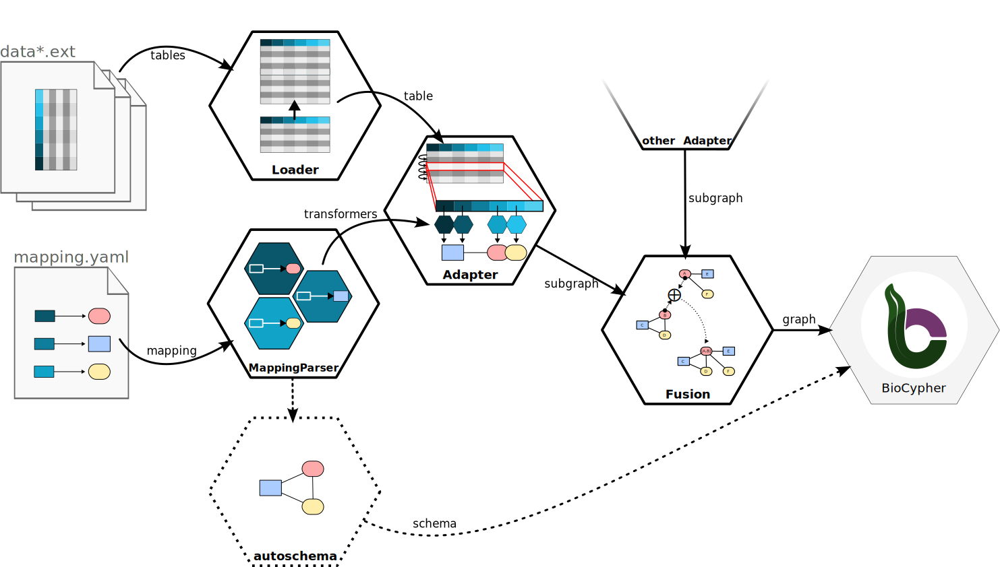

How does OntoWeaver works
-------------------------

This sections targets developpers willing to know more about how to use
OntoWeaver as a library, or about how to add features to it.
Here, we go into some details of the different steps and modules of
OntoWeaver, most notably:

1. how the :ref:`loaders <loaders>` manage iterable input data,
2. how the :ref:`mappings are parsed <mapping-parser>` to produce type-aware transformers,
3. how the :ref:`adapters <adapters>` extract graphs,

Explanations about how the fusion module merges graphs are given in the
:ref:`next section <Information Fusion>`.

    
    A diagram showing the main steps of producing a graph with OntoWeaver.

OntoWeaver and BioCypher
^^^^^^^^^^^^^^^^^^^^^^^^

Technically, OntoWeaver is a wrapper around BioCypher. It allows to parse several
input data and pass them to BioCypher, which creates the final SKG.
Both OntoWeaver and BioCypher are written in the "Python" programming language,
and use YAML configuration files.

OntoWeaver is in charge of:

- parsing and loading input data,
- then extracting the data of interest,
- mapping them into typed nodes and edges,
- and fusing them to avoid duplicates.

After the graph is fused, it passes it to BioCypher, that:

- assemble a taxonomy,
- apply the hierarchy of types onto nodes and edges,
- and export an SKG into the desired format.

At each steps, both tools perform some consistency checks.

Architecture
^^^^^^^^^^^^

OntoWeaver is designed with *Object Oriented Programming*, and usually rely on
the *Functors Strategy* design pattern, with a shallow inheritance tree and
priority to *composition*.

The most important processing steps are handled by objects, which are
callable like functions (i.e. "functors"). That is:

- you must first instantiate a class, creating an object, to which you pass the
  parameters configuring its behavior,
- you can then use that instance just as if it was a function.
- The classes providing the features are inheriting from an abstract base
  class that we call the "interface".

The generic structure looks like:

.. code-block:: python

    # The interface is provided to you by OntoWeaver,
    # if you want to add a feature, you will have to
    # implement it in your own class.
    class Interface(metaclass = ABCMeta.ABSTRACT):
        def __init__(self, param):
            self.param = param

        # This decorator makes instantiating/calling
        # the interface impossible.
        @abstractmethod
        def __call__(self, data):
            raise NotImplementedError()

    # An implementation inherits from the interface,
    # and actually do something.
    class Feature(Interface):
        def __init__(self, param, other_param):
            self.other_param = other_param
            super().__init__(param)

        # You MUST implement the abstract method(s).
        def __class__(self, data):
            # Do something with data.
            return result

    # To use the Feature, first instantiate it...
    functor = Feature(1, 2)

    # ... then call it.
    result = functor(data)

.. seealso::
    If you want more examples and code demonstrations in various languages showing
    why this design pattern is useful, check the
    `algopattern <https://github.com/nojhan/algopattern>`_ project.

In the sections below, the interfaces are discussed, but not all the
implentations. See the :mod:`ontoweaver` module documentation extracted from
the code to find the features you are searching for.

.. _error-management:

Error Management
^^^^^^^^^^^^^^^^

Classes may inherit from the :class:`~ontoweaver.errormanager.ErrorManager` to
get access to the :meth:`~ontoweaver.errormanager.ErrorManager.error` method.

This superclass allows to log and raise errors in a way that honors the
`raise_errors` parameter, along with indications about the location from which
the error was raised, and indentation of the corresponding log message.

In OntoWeaver, interface classes usually inherit from this class.

.. attention::

    The fact that OntoWeaver's interface classes inherits from the ErrorManager
    is a design error that will be fixed in future versions. The ErrorManager
    will become an utility class member, and the call signature may change.

.. _loaders:

Input Data Loaders
^^^^^^^^^^^^^^^^^^

Classes derived from the :class:`~ontoweaver.loader.Loader` interface are in
charge of:

- claiming which data they can load (for instance from the extension of a file),
  through the :meth:`~ontoweaver.loader.Loader.allows` method,
- loading the data (optionally, from several compatible files), throught the
  :meth:`~ontoweaver.loader.Loader.load` method,
- expose the compatible :class:`~ontoweaver.base.Adapter` class that can manage the data they
  loaded, through the :meth:`~ontoweaver.loader.Loader.adapter` method.

The :class:`~ontoweaver.loader.Loader` interface provides the
:meth:`~ontoweaver.loader.Loader.extensions`
method that returns the list of extensions of the files that are considered.

If you know what kind of data you are loading, you can use loaders directly
on an input file:

.. code-block:: python

    def load(filename):

        lpf = ontoweaver.loader.LoadPandasFile()
        # Note that `load` takes a list of items,
        # even if there's only one.
        # Any other artgument will be passed to
        # the underlying (here, Pandas) function.
        data = lpf.load([filename], sep = ";")  # Note the list brackets.

But loaders are especially useful when you can get several input formats, and
you don't know which one in advance. In which case, you can find the loader that
can handle the input item:

.. code-block:: python

    def load(item, **kwargs):

        lpf = ontoweaver.loader.LoadPandasFile()
        lpd = ontoweaver.loader.LoadPandasDataframe()
        lof = ontoweaver.loader.LoadOWLFile()
        log = ontoweaver.loader.LoadOWLGraph()

        for loader in [lpf, lpd, lof, log]:
            if loader.allows([item]):
                try:
                    data = loader.load([item], **kwargs)
                except Exception as err:
                    print(f"While loading `{data}` with kwargs: {kwargs}")
                    raise err

Loaders also expose which :class:`~ontoweaver.base.Adapter` they expect their
loaded data to be managed with, so that you can chain them automatically (see
the following sections).

.. _mapping-parser:

Mapping parser
^^^^^^^^^^^^^^

The mapping parser is in charge of building up the set of classes representing
the mappable types, and the set of :class:`~ontoweaver.base.Transformer` that
will extract data and create nodes and edges.

So far, there's only one mapping parser: :class:`~ontoweaver.mapping.YamlParser`.
It derives from :class:`~ontoweaver.base.MappingParser`, which provides the
vocabulary (all the mapping keys: ``to_object``, ``via_relation`` and so on),
which in turn inherits from :class:`~ontoweaver.base.Declare`, which provides
utility functions for creating Python classes on the fly.

In OntoWeaver, the mapping parser creates all types of nodes and edges as Python
classes (by default within the ``ontoweaver.types`` module).

For each item in the ``transformers`` list of the YAMP mapping file, it also
instantiate the declared :mod:`transformer`, which are later called by the
:ref:`adapters <adapters>` to produce data.

.. _adapters:

Iterative Adapters
^^^^^^^^^^^^^^^^^^

Classes derived from the :class:`~ontoweaver.base.Adapter` interface are in
charge of implementing the :meth:`~ontoweaver.base.Adapter.run` generator, which
will yield a pair of ``(nodes, edges)`` for every iteration. It can yield several
nodes and edges at each iteration.

OntoWeaver being focused on *iterable* data structure, it provides a
:class:`~ontoweaver.iterative.IterativeAdapter` interface. This abstract class
provides a lot of code for creating nodes and edges, and simplifies the
implementations targeting specific data structures. It also allows for parallel
processing of an iterable data structure.

This manages the instantiated transformers by itself, so that someone implementing
an adapter for a new kind of document does not have to bother with this part.

The classes that actually implement an adapter feature inherits from
:class:`~ontoweaver.iterative.IterativeAdapter` and implement the
:meth:`~ontoweaver.iterative.IterativeAdapter.iterate` method, which should be
implemented as a generator yielding the index of the processed index, along with
the item itself. It will be called by iterative adapters as:

.. code-block:: python

    for i,item in self.iterate():
        # process

A simple example of an implementation is the
:class:`~ontoweaver.tabular.PandasAdapter`, which implementation is almost
equivalent to:

.. code-block:: python

    class PandasAdapter(ontoweaver.iterative.IterativeAdapter):
        def __init__(self, df):
            self.df = df

        def iterate(self);
            # Pandas provides this function that is a generator consuming rows:
            return self.df.iterrows()

Other implementations are the :class:`~ontoweaver.xml.XMLAdapter` and the
:class:`~ontoweaver.json.JSONAdapter`, which both use a query language to
extract a table of items, on which they then iterate.

Making it work together
^^^^^^^^^^^^^^^^^^^^^^^

If the :ref:`ontoweave <ontoweave>` command does not suits your need (for instance
if you need to do some pre-processing on your data), you will want to load data,
parse the mapping and run the adapter by yourself.

A minimal implementation of this would look like:

.. code-block:: python

    import ontoweaver
    import yaml

    # Register all the transformers in your dedicated module:
    ontoweaver.transformer.register_all( my_module_path )

    datafile = "path/to/my/file.csv"
    mappingfile = "path/to/my/mapping.yaml"

    # Load the data.
    loader = ontoweaver.loader.LoadPandasFile() # For CSVs.
    data = loader([filename])

    # Load the YAML mapping.
    with open(mappingfile, 'r') as fd:
        config = yaml.full_load(fd)

    # Instantiate the parser.
    parser = ontoweaver.mapping.YamlParser(config)

    # Run the parser.
    mapper = parser()

    # Instantiate the related adapter
    # (the class is selected from the loader). 
    adapter = loader.adapter(data, mapper)

    # Run the data extraction.
    nodes = []
    edges = []
    for local_nodes, local_edges in adapter():
        nodes += local_nodes
        edges += local_edges

    # Call BioCypher to write the import files.
    importfile = write(nodes, edges, biocypher_config_path, schema_path)

