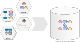
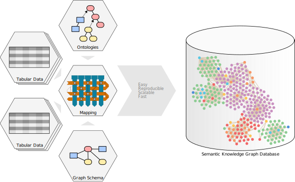

Tutorials
---------

Simplest possible full example
~~~~~~~~~~~~~~~~~~~~~~~~~~~~~~

Introduction
^^^^^^^^^^^^

To build up a SKG from scratch, you will need at least five files:

1. some data, for instance in a table: ``data.csv``,
2. An ontology file, containing the taxonomy of types you want
   to use: ``ontology.ttl``.
3. a BioCypher configuration indicating what ontologies to use, and what
   database to export to: ``config.yaml``,
4. a mapping, indicating what column of the table to map on which type of the
   ontology: ``mapping.yaml``.

Files
^^^^^

Let' say we want to extract a graph of 4 nodes and 3 edges from a table
with 3 rows and 2 columns, those files would look like the following.

.. code-block:: csv
    :caption: simple_data.csv
    
    Stuff,Gizmo
    S1,GA
    S1,GO
    S2,GA

.. code-block:: ttl
    :caption: simple_ontology.ttl
    
    @prefix : <https://my.domain.tld/ontology#> .
    @prefix owl: <http://www.w3.org/2002/07/owl#> .
    @prefix rdfs: <http://www.w3.org/2000/01/rdf-schema#> .
    @prefix biocypher: <https://biocypher.org/biocypher#> .
    
    biocypher:BioCypherRoot a rdfs:Class ;
         rdfs:label "BioCypherRoot" .
    
    owl:thing a rdfs:Class ;
        rdfs:label "thing" ; # Note how labels are uppercased.
        rdfs:subClassOf biocypher:BioCypherRoot .
    
    :node a rdfs:Class ;
        rdfs:label "node" ;
        rdfs:subClassOf owl:thing .
    
    :edge a owl:ObjectProperty ;
        rdfs:label "edge" ;
        rdfs:subPropertyOf biocypher:BioCypherRoot .

.. code-block:: yaml
    :caption: simple_config.yaml
    
    biocypher:
        dbms: owl # For example, here, we output in an OWL file.
    
        head_ontology:
            url: tests/simplest_example/ontology.ttl
            root_node: BioCypherRoot
    
    owl: # Options for the chosen OWL DBMS.
        rdf_format: turtle
        edge_model: ObjectProperty
        labels_order: Leaves
        node_labels_order: Leaves
        edge_labels_order: Leaves

.. code-block:: yaml
    :caption: simple_mapping.yaml
    
    row:
        map:
            column: Stuff     # Columns are uppercased.
            to_subject: thing # But types are converted to lowercase.
    transformers:
        - map:
            column: Gizmo
            # You can map to any label,
            # as the schema will have the
            # last word on the actual type.
            to_object: node
            # But convention dictates to just
            # use the type, as seen by BioCypher,
            # because this is simpler to understand.
            via_relation: edge

Result
^^^^^^

Now, you have to run OntoWeaver, using all those files::
   
   ontoweave -C config.yaml -m schema.yaml data.csv:mapping.yaml

This will print in which directory is the populated OWL file.

The output file should look like this populated OWL file:

.. code-block:: ttl
   :caption: The ``ontology.ttl`` file.
   
   # This part is the same as the input ontology:
   @prefix : <https://my.domain.tld/ontology#> .
   @prefix biocypher: <https://biocypher.org/biocypher#> .
   @prefix owl: <http://www.w3.org/2002/07/owl#> .
   @prefix rdfs: <http://www.w3.org/2000/01/rdf-schema#> .

   owl:thing a rdfs:Class ;
       rdfs:label "thing" ;
       rdfs:subClassOf biocypher:BioCypherRoot .

   biocypher:BioCypherRoot a rdfs:Class ;
       rdfs:label "BioCypherRoot" .

   :node a rdfs:Class ;
       rdfs:label "node" ;
       rdfs:subClassOf owl:Thing .

   :dge a owl:ObjectProperty ;
       rdfs:label "edge" ;
       rdfs:subPropertyOf biocypher:BioCypherRoot .

   # This part contains the actual graph data:
   :S1 a owl:NamedIndividual,
           owl:hing ;
       rdfs:label "S1" ;
       biocypher:id "S1" ;
       biocypher:preferred_id "id" ;
       :edge :GA,
           :GO .

   :S2 a owl:NamedIndividual,
           owl:hing ;
       rdfs:label "S2" ;
       biocypher:id "S2" ;
       biocypher:preferred_id "id" ;
       :edge :GO .

   :GA a owl:NamedIndividual,
           biocypher:node ;
       rdfs:label "GA" ;
       biocypher:id "GA" ;
       biocypher:preferred_id "id" .

   :GO a owl:NamedIndividual,
           biocypher:node ;
       rdfs:label "GO" ;
       biocypher:id "GO" ;
       biocypher:preferred_id "id" .

.. _fully_fledged_demo:

Fully fledged demo
~~~~~~~~~~~~~~~~~~

This tutorial tries to show as much as possible of OntoWeaver's features, with
all explanations inserted as comments in the actual files.

Input files
^^^^^^^^^^^

Those files are usually provided by someone else, and you want to use them.

.. WARNING: always keep the four-space indentation in all of the codes of this section.
.. Because the test_full_fledge_demo rely on extracting those source codes.

.. code-block:: csv
    :caption: demo_data.csv
    
    Patient,Sample_location,Sample_ID,Gene,Type,Location,Impact,Metadata,Sources
    Albert,Liver,1,brca1,SNP,Chr1_23_A>G,Oncogenic,"{""ref"":""A"", ""date"":""2026-02-15""}","Pubmed:12345,DOI:abc_123"
    Albert,Liver,2,brca2,SNP,Chr2_34_G>C,Likely oncogenic,"{""ref"":""B"", ""date"":""2026-02-15""}",
    Albert,Liver,3,CLOCK,SNP,Chr4_56_A>C,Not oncogenic,"{""ref"":""A"", ""date"":""2026-02-15""}",Pubmed:9876
    Josette,Prostate,1,brca2,CNV,Chr2,Likely oncogenic,"{""ref"":""C"", ""date"":""2026-02-15""}",DOI:azr_987
    Josette,Prostate,2,brca2,SNP,Chr2_34_G>C,Likely oncogenic,"{""ref"":""C"", ""date"":""2026-02-15""}","DOI:abc_123,Pubmed:9876"

Which encodes the following table:

+---------+-----------------+-----------+-------+------+-------------+------------------+----------------------------------+--------------------------+
| Patient | Sample_location | Sample_ID | Gene  | Type | Location    | Impact           | Metadata                         | Sources                  |
+=========+=================+===========+=======+======+=============+==================+==================================+==========================+
| Albert  | Liver           | 1         | brca1 | SNP  | Chr1_23_A>G | Oncogenic        | {"ref":"A", "date":"2026-02-15"} | Pubmed:12345,DOI:abc_123 |
+---------+-----------------+-----------+-------+------+-------------+------------------+----------------------------------+--------------------------+
| Albert  | Liver           | 2         | brca2 | SNP  | Chr2_34_G>C | Likely oncogenic | {"ref":"B", "date":"2026-02-15"} |                          |
+---------+-----------------+-----------+-------+------+-------------+------------------+----------------------------------+--------------------------+
| Albert  | Liver           | 3         | CLOCK | SNP  | Chr4_56_A>C | Not oncogenic    | {"ref":"A", "date":"2026-02-15"} | Pubmed:9876              |
+---------+-----------------+-----------+-------+------+-------------+------------------+----------------------------------+--------------------------+
| Josette | Prostate        | 1         | brca2 | CNV  | Chr2        | Likely oncogenic | {"ref":"C", "date":"2026-02-15"} | DOI:azr_987              |
+---------+-----------------+-----------+-------+------+-------------+------------------+----------------------------------+--------------------------+
| Josette | Prostate        | 2         | brca2 | SNP  | Chr2_34_G>C | Likely oncogenic | {"ref":"C", "date":"2026-02-15"} | DOI:abc_123,Pubmed:9876  |
+---------+-----------------+-----------+-------+------+-------------+------------------+----------------------------------+--------------------------+

.. code-block:: ttl
    :caption: demo_ontology.ttl
    
    # Namespaces:
    
    @prefix : <https://my.domain.tld/ontology#> .
    @prefix owl: <http://www.w3.org/2002/07/owl#> .
    @prefix rdfs: <http://www.w3.org/2000/01/rdf-schema#> .
    @prefix biocypher: <https://biocypher.org/biocypher#> .
    
    #######################################################
    # The "taxonomy" part of the ontology
    # (sometimes called the "vocabulary")
    #######################################################
    
    # We need a base root to which to attach all types.
    # Because we allow to assemble type hierarchy trees.
    biocypher:BioCypherRoot a rdfs:Class ; # `a` means the same than `rdf:type`.
         rdfs:label "BioCypherRoot" . # We need label on ALL types. Do not forget them.
    
    # Classical types, serving ase bases.
    
    owl:thing a rdfs:Class ; # Type for nodes.
        rdfs:label "thing" ; # Note how labels are uppercased.
        rdfs:subClassOf biocypher:BioCypherRoot . # `subClassOf` means the same than `is_a`.
    
    :association a owl:ObjectProperty ; # Type for edges.
        rdfs:label "association" ;
        rdfs:subPropertyOf biocypher:BioCypherRoot . # We need to attach object properties to the root node.
    
    # Our own node types, inheriting from the others:
    
    :patient a rdfs:Class ; # a Class = is a node.
        rdfs:label "patient" ;
        rdfs:subClassOf owl:thing . # Inherits from thing = is a node.
    
    :sample a rdfs:Class ;
        rdfs:label "sample" ;
        rdfs:subClassOf owl:thing .
    
    :gene a rdfs:Class ;
        rdfs:label "gene" ;
        rdfs:subClassOf owl:thing .
    
    :alteration a rdfs:Class ;
        rdfs:label "alteration" ;
        rdfs:subClassOf owl:thing .
    
    :publication a rdfs:Class ;
        rdfs:label "publication" ;
        rdfs:subClassOf owl:thing .
    
    :effect a rdfs:Class ;
        rdfs:label "effect" ;
        rdfs:subClassOf owl:thing .
    
    # Our own edge types:
    
    :insample a owl:ObjectProperty ;
        rdfs:label "insample" ;
        rdfs:subPropertyOf :association .
    
    :hasalteration a owl:ObjectProperty ;
        rdfs:label "hasalteration" ;
        rdfs:subPropertyOf :association .
    
    :ongene a owl:ObjectProperty ;
        rdfs:label "ongene" ;
        rdfs:subPropertyOf :association .
    
    :knownhas a owl:ObjectProperty ;
        rdfs:label "knownhas" ;
        rdfs:subPropertyOf :association .
    
    :publishedin a owl:ObjectProperty ;
        rdfs:label "publishedin" ;
        rdfs:subPropertyOf :association .
    
    :knownas a owl:ObjectProperty ;
        rdfs:label "knownas" ;
        rdfs:subPropertyOf :association .

Config files
^^^^^^^^^^^^

Those are the files you are supposed to write: the schema, the mapping and the
config.

.. code-block:: yaml
    :caption: demo_schema.yaml
    
    # This "schema*"file mainly serves to define what types you are using.
    # In the simplest case (like here), it allows to *extend* the ontology.
    
    # We want to manually extend the taxonomy,
    # without touching to the ontology file
    # (which may be maintained by some other expert).
    
    mutation: # Add this class...
        is_a: alteration # ... as a subClassOf this one.
    
    copyNumberVariation:
        is_a: alteration
    
    # We could have defined a lot more things here (see BioCyoher's documentation),
    # but we will let OntoWeaver extend this schema to a complete one by itself.

.. code-block:: yaml
    :caption: demo_mapping.yaml
    
    # This "mapping" file is the most important configuration for OntoWeaver.
    # It is the one defining what to map on which node or edge.
    
    row: # Each row of the data represents and object of interest: a node.
        cat_format: # We assemble an identifier by using several columns.
            columns:
                - Gene
                - Type
                - Location
            format_string: "{Gene}_{Type}_{Location}" # Following Python standard with column names.
            match: # Assign a different type, depending on the ID value.
                - SNP: # If the assembled ID contains "SNP".
                    to_subject: mutation # The "subject" is the type of the "row" node.
                - .*CNV.*: # Another way to encode "contains CNV" as a regular expression.
                    to_subject: copyNumberVariation
    
    transformers: # Now that we have a subject, we will link other nodes to it.
        - map: # Take the cell value and make it a node.
            column: Patient
            to_object: patient # The type of the node that's linked to the subject node.
            via_relation: hasalteration # The edge type.
    
        - cat: # An even simpler concatenation.
            columns:
                - Sample_location
                - Sample_ID
            to_object: sample
            via_relation: insample
    
        - upper: # `map` with a change of case.
            column: Gene
            to_object: gene
            via_relation: ongene
    
        - map:
            column: Impact
            from_subject: gene # You can create edges from a node that's node the subject.
            to_object: effect # Types may be different from the column name.
            via_relation: knownas
    
        - map:
            column: Impact # You can re-use any columns several times.
            to_property: oncogenicity # Creates a key-value pair {"oncogenicity": <cell value>}...
            for_object: gene # ... attached to nodes of type "Gene".
    
        - replace:
            column: Location # You can use the same colum in several transformers.
            to_property: locations
            for_object: gene
            forbidden: "_"  # Remove this regular expression...
            substitute: ":" # ... and replace matching strings with this one.
    
        # - nested:
        #     keys:
        #         - Metadata # The column.
        #         - ref # The key within the JSON object.
        #     to_property: reference
        #     for_object: has_alteration # You can attach properties to edges. FIXME
    
        - nested:
            keys:
                - Metadata
                - date
            to_property: date
            for_object: sample # Even if this comes from the same column, this can be attached to separated objects.
    
        - split: # Split the cell content and create as many nodes of the same type as it contains items.
            column: Sources
            to_object: publication
            via_relation: publishedin

.. code-block:: yaml
    :caption: demo_config.yaml
    
    # This "config" file indicates how to assemble your taxonomy,
    # and in which format to export the produced graph.
    
    biocypher:
        dbms: owl  # This will output an ontology file.
        head_ontology:
            url: tests/full_fledge_demo/ontology.ttl # The file above, your path may vary.
            root_node: BioCypherRoot
    
    owl:
        edge_model: ObjectProperty # A classical OWL ontology.
        file_format: turtle # A format readable by humans (the one used above).
        labels_order: Leaves
        node_labels_order: Leaves
        edge_labels_order: Leaves

Run ontoweave
^^^^^^^^^^^^^

To run OntoWeaver and weave those data into a semantic knowledge graph, use the following command:

.. code-block:: sh

    ontoweave --biocypher-config demo_config.yaml --auto-schema extended_schema.yaml --auto-schema-overwrite --biocypher-schema demo_schema.yaml demo_data.csv:demo_mapping.yaml

Expected output file
^^^^^^^^^^^^^^^^^^^^

.. code-block:: ttl
    :caption:  biocypher-out/.../biocypher.ttl
    
    :publication a rdfs:Class ;
        rdfs:label "publication" ;
        rdfs:subClassOf owl:thing .

    :sample a rdfs:Class ;
        rdfs:label "sample" ;
        rdfs:subClassOf owl:thing .

    :CLOCK_SNP_Chr4_56_A%3EC a owl:NamedIndividual,
            biocypher:Mutation ;
        rdfs:label "CLOCK_SNP_Chr4_56_A>C" ;
        biocypher:id "CLOCK_SNP_Chr4_56_A>C" ;
        biocypher:preferred_id "id" ;
        :hasalteration :Albert ;
        :insample :Liver3 ;
        :ongene :clock ;
        :publishedin :Pubmed%3A9876 .

    :brca1_SNP_Chr1_23_A%3EG a owl:NamedIndividual,
            biocypher:Mutation ;
        rdfs:label "brca1_SNP_Chr1_23_A>G" ;
        biocypher:id "brca1_SNP_Chr1_23_A>G" ;
        biocypher:preferred_id "id" ;
        :hasalteration :Albert ;
        :insample :Liver1 ;
        :ongene :brca1 ;
        :publishedin :Pubmed%3A12345%2CDOI%3Aabc_123 .

    :brca2_CNV_Chr2 a owl:NamedIndividual,
            biocypher:CopyNumberVariation ;
        rdfs:label "brca2_CNV_Chr2" ;
        biocypher:id "brca2_CNV_Chr2" ;
        biocypher:preferred_id "id" ;
        :hasalteration :Josette ;
        :insample :Prostate1 ;
        :ongene :brca2 ;
        :publishedin :DOI%3Aazr_987 .

    :brca2_SNP_Chr2_34_G%3EC a owl:NamedIndividual,
            biocypher:Mutation ;
        rdfs:label "brca2_SNP_Chr2_34_G>C" ;
        biocypher:id "brca2_SNP_Chr2_34_G>C" ;
        biocypher:preferred_id "id" ;
        :hasalteration :Albert,
            :Josette ;
        :insample :Liver2,
            :Prostate2 ;
        :ongene :brca2 ;
        :publishedin :DOI%3Aabc_123%2CPubmed%3A9876 .

    :hasalteration a owl:ObjectProperty ;
        rdfs:label "hasalteration" ;
        rdfs:sub@prefix : <https://my.domain.tld/ontology#> .
    @prefix biocypher: <https://biocypher.org/biocypher#> .
    @prefix owl: <http://www.w3.org/2002/07/owl#> .
    @prefix rdfs: <http://www.w3.org/2000/01/rdf-schema#> .
    @prefix xsd: <http://www.w3.org/2001/XMLSchema#> .

    owl:thing a rdfs:Class ;
        rdfs:label "thing" ;
        rdfs:subClassOf biocypher:BioCypherRoot .

    biocypher:BioCypherRoot a rdfs:Class ;
        rdfs:label "BioCypherRoot" .

    :alteration a rdfs:Class ;
        rdfs:label "alteration" ;
        rdfs:subClassOf owl:thing .

    :effect a rdfs:Class ;
        rdfs:label "effect" ;
        rdfs:subClassOf owl:thing .

    :gene a rdfs:Class ;
        rdfs:label "gene" ;
        rdfs:subClassOf owl:thing .

    :patient a rdfs:Class ;
        rdfs:label "patient" ;
        rdfs:subClassOf owl:thing .

    PropertyOf :association .

    :insample a owl:ObjectProperty ;
        rdfs:label "insample" ;
        rdfs:subPropertyOf :association .

    :knownas a owl:ObjectProperty ;
        rdfs:label "knownas" ;
        rdfs:subPropertyOf :association .

    :knownhas a owl:ObjectProperty ;
        rdfs:label "knownhas" ;
        rdfs:subPropertyOf :association .

    :ongene a owl:ObjectProperty ;
        rdfs:label "ongene" ;
        rdfs:subPropertyOf :association .

    :publishedin a owl:ObjectProperty ;
        rdfs:label "publishedin" ;
        rdfs:subPropertyOf :association .

    biocypher:CopyNumberVariation a biocypher:Alteration .

    :DOI%3Aabc_123%2CPubmed%3A9876 a owl:NamedIndividual,
            biocypher:Publication ;
        rdfs:label "DOI:abc_123,Pubmed:9876" ;
        biocypher:id "DOI:abc_123,Pubmed:9876" ;
        biocypher:preferred_id "id" .

    :DOI%3Aazr_987 a owl:NamedIndividual,
            biocypher:Publication ;
        rdfs:label "DOI:azr_987" ;
        biocypher:id "DOI:azr_987" ;
        biocypher:preferred_id "id" .

    <https://my.domain.tld/ontology#Likely+oncogenic> a owl:NamedIndividual,
            biocypher:Effect ;
        rdfs:label "Likely oncogenic" ;
        biocypher:id "Likely oncogenic" ;
        biocypher:preferred_id "id" .

    :Liver1 a owl:NamedIndividual,
            biocypher:Sample ;
        rdfs:label "Liver1" ;
        xsd:date "2026-02-15" ;
        biocypher:id "Liver1" ;
        biocypher:preferred_id "id" .

    :Liver2 a owl:NamedIndividual,
            biocypher:Sample ;
        rdfs:label "Liver2" ;
        xsd:date "2026-02-15" ;
        biocypher:id "Liver2" ;
        biocypher:preferred_id "id" .

    :Liver3 a owl:NamedIndividual,
            biocypher:Sample ;
        rdfs:label "Liver3" ;
        xsd:date "2026-02-15" ;
        biocypher:id "Liver3" ;
        biocypher:preferred_id "id" .

    <https://my.domain.tld/ontology#Not+oncogenic> a owl:NamedIndividual,
            biocypher:Effect ;
        rdfs:label "Not oncogenic" ;
        biocypher:id "Not oncogenic" ;
        biocypher:preferred_id "id" .

    :Oncogenic a owl:NamedIndividual,
            biocypher:Effect ;
        rdfs:label "Oncogenic" ;
        biocypher:id "Oncogenic" ;
        biocypher:preferred_id "id" .

    :Prostate1 a owl:NamedIndividual,
            biocypher:Sample ;
        rdfs:label "Prostate1" ;
        xsd:date "2026-02-15" ;
        biocypher:id "Prostate1" ;
        biocypher:preferred_id "id" .

    :Prostate2 a owl:NamedIndividual,
            biocypher:Sample ;
        rdfs:label "Prostate2" ;
        xsd:date "2026-02-15" ;
        biocypher:id "Prostate2" ;
        biocypher:preferred_id "id" .

    :Pubmed%3A12345%2CDOI%3Aabc_123 a owl:NamedIndividual,
            biocypher:Publication ;
        rdfs:label "Pubmed:12345,DOI:abc_123" ;
        biocypher:id "Pubmed:12345,DOI:abc_123" ;
        biocypher:preferred_id "id" .

    :Pubmed%3A9876 a owl:NamedIndividual,
            biocypher:Publication ;
        rdfs:label "Pubmed:9876" ;
        biocypher:id "Pubmed:9876" ;
        biocypher:preferred_id "id" .

    :brca1 a owl:NamedIndividual,
            biocypher:Gene ;
        rdfs:label "brca1" ;
        biocypher:id "brca1" ;
        biocypher:locations "Chr1:23:A>G" ;
        biocypher:oncogenicity "Oncogenic" ;
        biocypher:preferred_id "id" ;
        :knownas :Oncogenic .

    :clock a owl:NamedIndividual,
            biocypher:Gene ;
        rdfs:label "clock" ;
        biocypher:id "clock" ;
        biocypher:locations "Chr4:56:A>C" ;
        biocypher:oncogenicity "Not oncogenic" ;
        biocypher:preferred_id "id" ;
        :knownas <https://my.domain.tld/ontology#Not+oncogenic> .

    biocypher:Alteration a biocypher:Thing .

    biocypher:Patient a biocypher:Thing .

    :Josette a owl:NamedIndividual,
            biocypher:Patient ;
        rdfs:label "Josette" ;
        biocypher:id "Josette" ;
        biocypher:preferred_id "id" .

    :brca2 a owl:NamedIndividual,
            biocypher:Gene ;
        rdfs:label "brca2" ;
        biocypher:id "brca2" ;
        biocypher:locations "Chr2;Chr2:34:G>C" ;
        biocypher:oncogenicity "Likely oncogenic" ;
        biocypher:preferred_id "id" ;
        :knownas <https://my.domain.tld/ontology#Likely+oncogenic> .

    biocypher:Effect a biocypher:Thing .

    biocypher:Gene a biocypher:Thing .

    biocypher:Mutation a biocypher:Alteration .

    :Albert a owl:NamedIndividual,
            biocypher:Patient ;
        rdfs:label "Albert" ;
        biocypher:id "Albert" ;
        biocypher:preferred_id "id" .

    biocypher:Publication a biocypher:Thing .

    biocypher:Sample a biocypher:Thing .

    biocypher:Thing a biocypher:BioCypherRoot .

    :association a owl:ObjectProperty ;
        rdfs:label "association" ;
        rdfs:subPropertyOf biocypher:BioCypherRoot .
